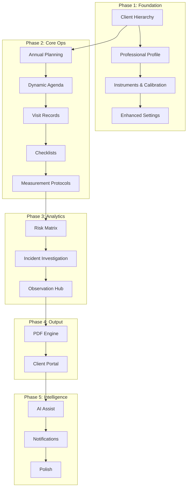
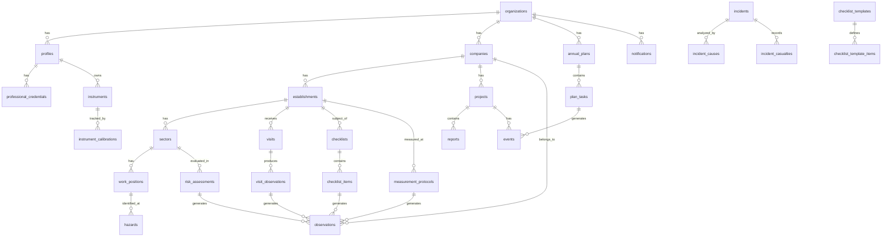
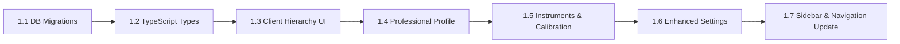
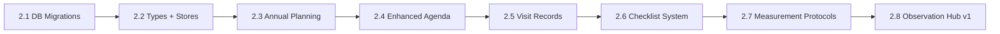
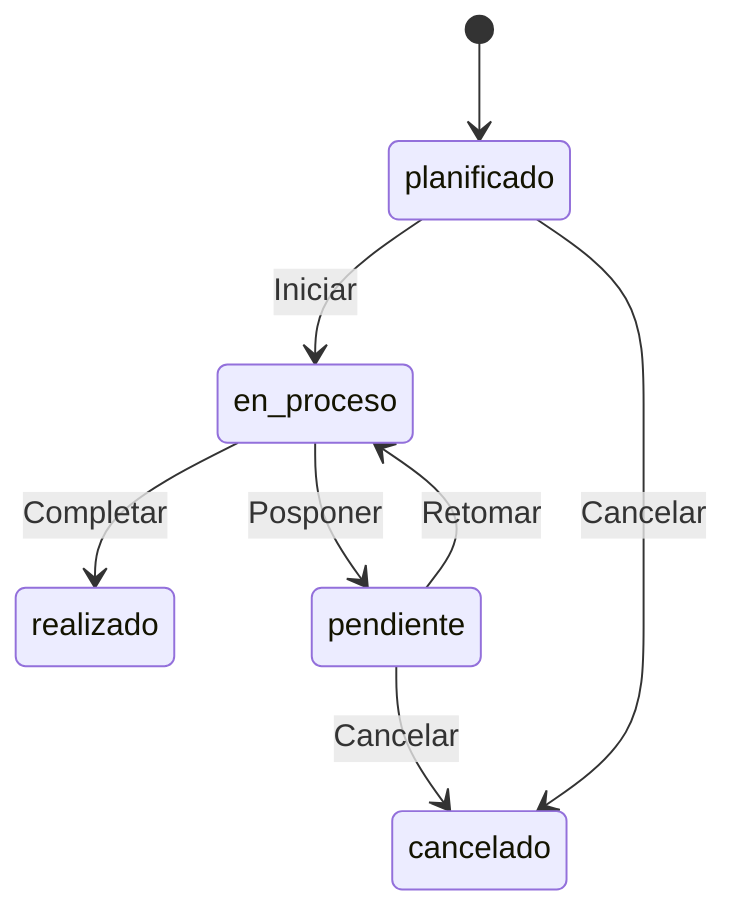
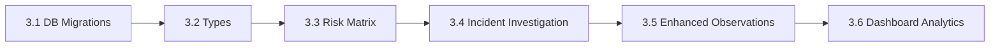
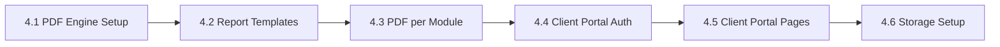
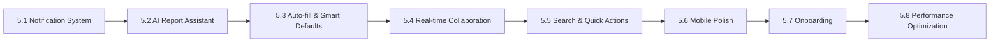

# CRM-SH Implementation Plan

> **For Claude:** REQUIRED SUB-SKILL: Use superpowers:executing-plans to implement this plan task-by-task.

**Goal:** Transform CRM-SH from a basic CRM with a fire load wizard into a comprehensive Safety & Hygiene management platform that matches and exceeds Genesis's 12-module feature set.

**Architecture:** Next.js 16 App Router + Supabase (Auth, PostgreSQL with RLS, Storage, Edge Functions). Multi-tenant via `organization_id` on every table. Zustand for client state, react-hook-form + zod for forms. All UI in Spanish (Argentine locale).

**Tech Stack:** Next.js 16.1.6, React 19, TypeScript 5.7, Tailwind CSS 3.4, shadcn/ui, Supabase, Zustand 5, recharts, zod, react-hook-form, lucide-react, date-fns, @react-pdf/renderer (to add).

---

## Table of Contents

1. [Executive Summary](#1-executive-summary)
2. [Genesis Competitive Analysis](#2-genesis-competitive-analysis)
3. [Gap Analysis: CRM-SH vs Genesis](#3-gap-analysis)
4. [Data Model Evolution](#4-data-model-evolution)
5. [Phase 1: Foundation Overhaul](#5-phase-1-foundation-overhaul)
6. [Phase 2: Core Operational Modules](#6-phase-2-core-operational-modules)
7. [Phase 3: Advanced Analytical Modules](#7-phase-3-advanced-analytical-modules)
8. [Phase 4: PDF Generation & Client Portal](#8-phase-4-pdf-generation--client-portal)
9. [Phase 5: AI, Automation & Polish](#9-phase-5-ai-automation--polish)
10. [Verification Criteria](#10-verification-criteria)

---

## 1. Executive Summary

### Current State (What CRM-SH Has)

| Feature | Status | Quality |
|---------|--------|---------|
| Auth (email/password) | Done | Good - SSR middleware, AuthGuard |
| Multi-tenant orgs | Done | Good - RLS on all tables |
| Dashboard | Done | Basic - stats cards, recent items |
| Clients CRUD | Done | Good - search, filter, CRUD |
| Projects CRUD | Done | Good - linked to clients, status workflow |
| Reports list | Done | Basic - create, duplicate, delete, filters |
| Fire Load Wizard (8 steps) | Done | Excellent - full calc engine, normative tables |
| Calendar/Events | Done | Basic - CRUD with types |
| Settings page | Done | Basic - org settings with JSONB |
| Theme (dark mode) | Done | Good - next-themes |
| Sidebar + layout | Done | Good - collapsible, responsive |

### Supabase Database (7 tables, all with RLS)

```
organizations (1 row)  - Multi-tenant root
profiles (1 row)       - Users, linked to auth.users
clients (0 rows)       - Flat client list
projects (0 rows)      - Client projects
reports (0 rows)       - Technical reports (form_data JSONB)
events (0 rows)        - Calendar events
org_settings (1 row)   - Professional data + templates (JSONB)
```

**Existing functions:** `handle_new_user`, `handle_new_profile` (auth triggers)

**Known issue:** `reports.status` CHECK constraint is missing `en_revision` (only allows `borrador`, `completado`, `enviado`, `vencido`).

### Target State

A 12-module professional platform for HyS technicians in Argentina:



---

## 2. Genesis Competitive Analysis

### Genesis's 12 Modules

| # | Module | Description | Priority for CRM-SH |
|---|--------|-------------|---------------------|
| 1 | **Professional Profile** | Multi-matricula credentials, instruments with calibration tracking, expiry alerts that BLOCK report creation | CRITICAL |
| 2 | **Client Management** | Company -> Establishment -> Sector -> Work Position hierarchy | CRITICAL |
| 3 | **Team Collaboration** | Invite professionals, share specific clients/establishments, granular permissions | HIGH |
| 4 | **Annual Planning** | Month-by-month task planning + training program scheduling | HIGH |
| 5 | **Dynamic Agenda** | Full task state machine (Planificado/En proceso/Realizado/Pendiente/Error), linked to all modules | HIGH |
| 6 | **Visit Records (Constancias)** | Actions + Observations forms that auto-feed the observation tracker | HIGH |
| 7 | **Checklists** | Predefined (Dec 351, Res 911, Res 617) + custom builder + fire extinguisher control | HIGH |
| 8 | **Measurement Protocols** | Illumination (Res 84/12), Noise (Res 85/12), Grounding (AEA 90364), official format, auto-compliance | CRITICAL |
| 9 | **Risk Matrix** | Hazard ID per position, 5-subindex probability, improvement proposals, theoretical re-evaluation | HIGH |
| 10 | **Incident Investigation** | Structured causal analysis (4 groups), casualty data, sinistrality indices | MEDIUM |
| 11 | **Observation Tracking** | Centralized hub for ALL deviations from ANY module, status tracking, resolution deadlines | HIGH |
| 12 | **PDF Generation** | Automated reports with branding (logos, signatures, credentials), official formats | CRITICAL |

### Genesis Strengths (Must Match)

1. **Calibration blocking**: Expired instrument certificates prevent creating measurement protocols. This is a legal compliance feature - professionals can lose their license if they use uncalibrated instruments.
2. **Observation tracking**: The "heart" of the preventive system. Every checklist finding, visit observation, and risk assessment feeds into a centralized observation hub with resolution tracking.
3. **Hierarchical data model**: Company > Establishment > Sector > Work Position mirrors real-world HyS operations accurately. A single company can have multiple physical locations (establishments), each with different sectors.
4. **Official protocol formats**: Res 84/12 (illumination) and Res 85/12 (noise) have specific legally-mandated table structures. Genesis replicates these exactly.
5. **Risk matrix with re-evaluation**: "What-if" analysis showing theoretical risk reduction when proposed improvements are implemented.

### Genesis Weaknesses (Our Advantages)

1. **No real-time features** - We have Supabase Realtime for live collaboration
2. **Desktop-first UI** - We're mobile-first responsive with modern design
3. **No dark mode** - We already have it
4. **No AI/automation** - Opportunity for AI-assisted report generation, auto-fill, smart suggestions
5. **No API** - We can expose a REST API for integrations
6. **No client portal** - We'll build one with read-only access
7. **Single-language** - We can add i18n later if needed
8. **No offline support** - Future PWA opportunity

---

## 3. Gap Analysis

### Feature Comparison Matrix

| Feature | Genesis | CRM-SH Now | CRM-SH Target | Phase |
|---------|---------|------------|----------------|-------|
| Multi-matricula profiles | Yes | Single matricula | Multi + validation | 1 |
| Instrument tracking | Yes + calibration blocking | No | Yes + blocking | 1 |
| Company hierarchy | 4 levels | Flat | 4 levels | 1 |
| Team invitations | Yes | No | Yes | 1 |
| Annual planning | Yes | No | Yes | 2 |
| Task state machine | 5 states | 1 boolean | 5 states | 2 |
| Visit records | Yes + observations | No | Yes + observations | 2 |
| Predefined checklists | 3 legal standards | No | 3 + custom builder | 2 |
| Illumination protocol | Res 84/12 | No | Yes | 2 |
| Noise protocol | Res 85/12 | No | Yes | 2 |
| Grounding protocol | AEA 90364 | No | Yes | 2 |
| Fire load study | Basic | Full 8-step wizard | Keep + enhance | - |
| Risk matrix | 5-subindex | No | Yes | 3 |
| Incident investigation | Yes | No | Yes | 3 |
| Observation hub | Central | No | Yes | 3 |
| PDF generation | Yes | No | Yes | 4 |
| Client portal | No | No | Yes | 4 |
| AI assistance | No | No | Yes | 5 |
| Real-time collab | No | No | Yes (Supabase RT) | 5 |
| Notification system | Basic | No | Email + in-app | 5 |

### Data Model Gaps

**Current data model is flat.** Key structural changes needed:

1. `clients` -> rename to `companies` (or add `establishments` as child of `clients`)
2. Add `establishments` table (physical locations of a company)
3. Move `sectors` from fire-load-only JSONB to a proper table linked to establishments
4. Add `work_positions` table linked to sectors
5. Add `instruments` and `instrument_calibrations` tables
6. Add `professional_credentials` table (multi-matricula)
7. Add `annual_plans` and `plan_tasks` tables
8. Add `visits` and `visit_observations` tables
9. Add `checklists`, `checklist_templates`, `checklist_items` tables
10. Add `measurement_protocols` and `measurement_points` tables
11. Add `risk_assessments`, `hazards`, `risk_evaluations` tables
12. Add `incidents`, `incident_causes`, `incident_casualties` tables
13. Add `observations` table (central hub)
14. Add `notifications` table

---

## 4. Data Model Evolution

### Entity Relationship Diagram



### Complete SQL Schema

Below is the FULL migration SQL for each new table. **Existing tables are NOT recreated** - only ALTER statements for changes.

#### Migration 001: Fix existing issues + add missing columns

```sql
-- Fix reports.status CHECK to include 'en_revision'
ALTER TABLE reports DROP CONSTRAINT IF EXISTS reports_status_check;
ALTER TABLE reports ADD CONSTRAINT reports_status_check
  CHECK (status = ANY (ARRAY['borrador', 'en_revision', 'completado', 'enviado', 'vencido']));

-- Add 'title' to reports if missing (it exists)
-- Add client_id directly to reports for quick access
ALTER TABLE reports ADD COLUMN IF NOT EXISTS client_id uuid REFERENCES clients(id);
```

#### Migration 002: Professional credentials & instruments

```sql
-- Professional credentials (multi-matricula)
CREATE TABLE professional_credentials (
  id uuid PRIMARY KEY DEFAULT gen_random_uuid(),
  profile_id uuid NOT NULL REFERENCES profiles(id) ON DELETE CASCADE,
  organization_id uuid NOT NULL REFERENCES organizations(id) ON DELETE CASCADE,
  tipo text NOT NULL CHECK (tipo IN ('matricula_provincial', 'matricula_nacional', 'registro_ambiental', 'otro')),
  numero text NOT NULL,
  jurisdiccion text, -- e.g., 'Buenos Aires', 'CABA', 'Nacional'
  entidad_emisora text, -- e.g., 'COPIME', 'CIE'
  fecha_emision date,
  fecha_vencimiento date, -- NULL = no expiry
  is_primary boolean DEFAULT false,
  created_at timestamptz DEFAULT now(),
  updated_at timestamptz DEFAULT now()
);

-- Instruments
CREATE TABLE instruments (
  id uuid PRIMARY KEY DEFAULT gen_random_uuid(),
  organization_id uuid NOT NULL REFERENCES organizations(id) ON DELETE CASCADE,
  owner_id uuid NOT NULL REFERENCES profiles(id),
  nombre text NOT NULL, -- e.g., 'Luxometro Tenmars TM-201'
  tipo text NOT NULL CHECK (tipo IN ('luxometro', 'decibelimetro', 'telurimetro', 'termometro', 'anemometro', 'otro')),
  marca text,
  modelo text,
  numero_serie text,
  is_active boolean DEFAULT true,
  created_at timestamptz DEFAULT now(),
  updated_at timestamptz DEFAULT now()
);

-- Instrument calibrations
CREATE TABLE instrument_calibrations (
  id uuid PRIMARY KEY DEFAULT gen_random_uuid(),
  instrument_id uuid NOT NULL REFERENCES instruments(id) ON DELETE CASCADE,
  organization_id uuid NOT NULL REFERENCES organizations(id) ON DELETE CASCADE,
  laboratorio text NOT NULL, -- calibration lab name
  numero_certificado text NOT NULL,
  fecha_calibracion date NOT NULL,
  fecha_vencimiento date NOT NULL,
  certificado_url text, -- Supabase Storage path
  notas text,
  created_at timestamptz DEFAULT now()
);

-- RLS policies
ALTER TABLE professional_credentials ENABLE ROW LEVEL SECURITY;
ALTER TABLE instruments ENABLE ROW LEVEL SECURITY;
ALTER TABLE instrument_calibrations ENABLE ROW LEVEL SECURITY;

CREATE POLICY "org_credentials_select" ON professional_credentials FOR SELECT
  USING (organization_id IN (SELECT organization_id FROM profiles WHERE id = auth.uid()));
CREATE POLICY "own_credentials_insert" ON professional_credentials FOR INSERT
  WITH CHECK (profile_id = auth.uid() AND organization_id IN (SELECT organization_id FROM profiles WHERE id = auth.uid()));
CREATE POLICY "own_credentials_update" ON professional_credentials FOR UPDATE
  USING (profile_id = auth.uid());
CREATE POLICY "own_credentials_delete" ON professional_credentials FOR DELETE
  USING (profile_id = auth.uid());

CREATE POLICY "org_instruments_select" ON instruments FOR SELECT
  USING (organization_id IN (SELECT organization_id FROM profiles WHERE id = auth.uid()));
CREATE POLICY "org_instruments_insert" ON instruments FOR INSERT
  WITH CHECK (organization_id IN (SELECT organization_id FROM profiles WHERE id = auth.uid()));
CREATE POLICY "org_instruments_update" ON instruments FOR UPDATE
  USING (organization_id IN (SELECT organization_id FROM profiles WHERE id = auth.uid()));
CREATE POLICY "org_instruments_delete" ON instruments FOR DELETE
  USING (organization_id IN (SELECT organization_id FROM profiles WHERE id = auth.uid()));

CREATE POLICY "org_calibrations_select" ON instrument_calibrations FOR SELECT
  USING (organization_id IN (SELECT organization_id FROM profiles WHERE id = auth.uid()));
CREATE POLICY "org_calibrations_insert" ON instrument_calibrations FOR INSERT
  WITH CHECK (organization_id IN (SELECT organization_id FROM profiles WHERE id = auth.uid()));
CREATE POLICY "org_calibrations_delete" ON instrument_calibrations FOR DELETE
  USING (organization_id IN (SELECT organization_id FROM profiles WHERE id = auth.uid()));

-- Helper function: check if an instrument has valid calibration
CREATE OR REPLACE FUNCTION public.instrument_has_valid_calibration(p_instrument_id uuid)
RETURNS boolean
LANGUAGE sql STABLE
AS $$
  SELECT EXISTS (
    SELECT 1 FROM instrument_calibrations
    WHERE instrument_id = p_instrument_id
      AND fecha_vencimiento >= CURRENT_DATE
  );
$$;
```

#### Migration 003: Client hierarchy (companies -> establishments -> sectors -> work_positions)

```sql
-- Establishments (physical locations of a client/company)
CREATE TABLE establishments (
  id uuid PRIMARY KEY DEFAULT gen_random_uuid(),
  organization_id uuid NOT NULL REFERENCES organizations(id) ON DELETE CASCADE,
  client_id uuid NOT NULL REFERENCES clients(id) ON DELETE CASCADE,
  nombre text NOT NULL, -- e.g., 'Planta Industrial San Martin'
  direccion text,
  localidad text,
  provincia text DEFAULT 'Buenos Aires',
  codigo_postal text,
  telefono text,
  email text,
  contacto_nombre text,
  actividad_principal text, -- e.g., 'Metalurgica', 'Alimenticia'
  ciiu text, -- industry classification code
  superficie_total_m2 numeric(10,2),
  cantidad_personal integer DEFAULT 0,
  is_active boolean DEFAULT true,
  created_at timestamptz DEFAULT now(),
  updated_at timestamptz DEFAULT now()
);

-- Sectors (areas within an establishment)
CREATE TABLE sectors (
  id uuid PRIMARY KEY DEFAULT gen_random_uuid(),
  organization_id uuid NOT NULL REFERENCES organizations(id) ON DELETE CASCADE,
  establishment_id uuid NOT NULL REFERENCES establishments(id) ON DELETE CASCADE,
  nombre text NOT NULL, -- e.g., 'Deposito', 'Oficinas', 'Planta baja'
  descripcion text,
  superficie_m2 numeric(10,2),
  tipo_actividad text, -- matches fire load study activity types
  clase_ventilacion text CHECK (clase_ventilacion IN ('natural', 'mecanica')),
  cantidad_personal integer DEFAULT 0,
  nivel text, -- 'planta_baja', 'primer_piso', 'subsuelo', etc.
  is_active boolean DEFAULT true,
  created_at timestamptz DEFAULT now(),
  updated_at timestamptz DEFAULT now()
);

-- Work positions (puestos de trabajo within a sector)
CREATE TABLE work_positions (
  id uuid PRIMARY KEY DEFAULT gen_random_uuid(),
  organization_id uuid NOT NULL REFERENCES organizations(id) ON DELETE CASCADE,
  sector_id uuid NOT NULL REFERENCES sectors(id) ON DELETE CASCADE,
  nombre text NOT NULL, -- e.g., 'Operador de torno', 'Administrativo'
  descripcion text,
  cantidad_trabajadores integer DEFAULT 1,
  turno text CHECK (turno IN ('manana', 'tarde', 'noche', 'rotativo')),
  horario_desde time,
  horario_hasta time,
  tareas_principales text, -- free text description of main tasks
  created_at timestamptz DEFAULT now(),
  updated_at timestamptz DEFAULT now()
);

-- RLS
ALTER TABLE establishments ENABLE ROW LEVEL SECURITY;
ALTER TABLE sectors ENABLE ROW LEVEL SECURITY;
ALTER TABLE work_positions ENABLE ROW LEVEL SECURITY;

CREATE POLICY "org_establishments_select" ON establishments FOR SELECT
  USING (organization_id IN (SELECT organization_id FROM profiles WHERE id = auth.uid()));
CREATE POLICY "org_establishments_insert" ON establishments FOR INSERT
  WITH CHECK (organization_id IN (SELECT organization_id FROM profiles WHERE id = auth.uid()));
CREATE POLICY "org_establishments_update" ON establishments FOR UPDATE
  USING (organization_id IN (SELECT organization_id FROM profiles WHERE id = auth.uid()));
CREATE POLICY "org_establishments_delete" ON establishments FOR DELETE
  USING (organization_id IN (SELECT organization_id FROM profiles WHERE id = auth.uid()));

CREATE POLICY "org_sectors_select" ON sectors FOR SELECT
  USING (organization_id IN (SELECT organization_id FROM profiles WHERE id = auth.uid()));
CREATE POLICY "org_sectors_insert" ON sectors FOR INSERT
  WITH CHECK (organization_id IN (SELECT organization_id FROM profiles WHERE id = auth.uid()));
CREATE POLICY "org_sectors_update" ON sectors FOR UPDATE
  USING (organization_id IN (SELECT organization_id FROM profiles WHERE id = auth.uid()));
CREATE POLICY "org_sectors_delete" ON sectors FOR DELETE
  USING (organization_id IN (SELECT organization_id FROM profiles WHERE id = auth.uid()));

CREATE POLICY "org_positions_select" ON work_positions FOR SELECT
  USING (organization_id IN (SELECT organization_id FROM profiles WHERE id = auth.uid()));
CREATE POLICY "org_positions_insert" ON work_positions FOR INSERT
  WITH CHECK (organization_id IN (SELECT organization_id FROM profiles WHERE id = auth.uid()));
CREATE POLICY "org_positions_update" ON work_positions FOR UPDATE
  USING (organization_id IN (SELECT organization_id FROM profiles WHERE id = auth.uid()));
CREATE POLICY "org_positions_delete" ON work_positions FOR DELETE
  USING (organization_id IN (SELECT organization_id FROM profiles WHERE id = auth.uid()));

-- Update events to support establishment_id
ALTER TABLE events ADD COLUMN IF NOT EXISTS establishment_id uuid REFERENCES establishments(id);

-- Update reports to support establishment_id
ALTER TABLE reports ADD COLUMN IF NOT EXISTS establishment_id uuid REFERENCES establishments(id);
```

#### Migration 004: Annual planning & enhanced events

```sql
-- Annual plans
CREATE TABLE annual_plans (
  id uuid PRIMARY KEY DEFAULT gen_random_uuid(),
  organization_id uuid NOT NULL REFERENCES organizations(id) ON DELETE CASCADE,
  client_id uuid NOT NULL REFERENCES clients(id) ON DELETE CASCADE,
  establishment_id uuid REFERENCES establishments(id),
  anio integer NOT NULL,
  titulo text NOT NULL,
  descripcion text,
  status text DEFAULT 'borrador' CHECK (status IN ('borrador', 'activo', 'completado', 'archivado')),
  created_by uuid REFERENCES auth.users(id),
  created_at timestamptz DEFAULT now(),
  updated_at timestamptz DEFAULT now(),
  UNIQUE(organization_id, client_id, establishment_id, anio)
);

-- Plan tasks (monthly breakdown)
CREATE TABLE plan_tasks (
  id uuid PRIMARY KEY DEFAULT gen_random_uuid(),
  plan_id uuid NOT NULL REFERENCES annual_plans(id) ON DELETE CASCADE,
  organization_id uuid NOT NULL REFERENCES organizations(id) ON DELETE CASCADE,
  mes integer NOT NULL CHECK (mes BETWEEN 1 AND 12),
  titulo text NOT NULL,
  descripcion text,
  tipo text NOT NULL CHECK (tipo IN (
    'visita', 'medicion_iluminacion', 'medicion_ruido', 'medicion_pat',
    'carga_de_fuego', 'relevamiento_riesgos', 'checklist',
    'capacitacion', 'simulacro', 'auditoria', 'otro'
  )),
  status text DEFAULT 'planificado' CHECK (status IN (
    'planificado', 'en_proceso', 'realizado', 'pendiente', 'cancelado'
  )),
  assigned_to uuid REFERENCES profiles(id),
  event_id uuid REFERENCES events(id), -- linked calendar event
  fecha_programada date,
  fecha_realizacion date,
  notas text,
  created_at timestamptz DEFAULT now(),
  updated_at timestamptz DEFAULT now()
);

-- Enhance events table with state machine
ALTER TABLE events ADD COLUMN IF NOT EXISTS status text DEFAULT 'planificado'
  CHECK (status IN ('planificado', 'en_proceso', 'realizado', 'pendiente', 'cancelado'));
ALTER TABLE events ADD COLUMN IF NOT EXISTS assigned_to uuid REFERENCES profiles(id);
ALTER TABLE events ADD COLUMN IF NOT EXISTS end_date timestamptz;
ALTER TABLE events ADD COLUMN IF NOT EXISTS recurrence text
  CHECK (recurrence IN ('none', 'daily', 'weekly', 'monthly', 'yearly'));
ALTER TABLE events ADD COLUMN IF NOT EXISTS plan_task_id uuid REFERENCES plan_tasks(id);

-- RLS
ALTER TABLE annual_plans ENABLE ROW LEVEL SECURITY;
ALTER TABLE plan_tasks ENABLE ROW LEVEL SECURITY;

CREATE POLICY "org_plans_select" ON annual_plans FOR SELECT
  USING (organization_id IN (SELECT organization_id FROM profiles WHERE id = auth.uid()));
CREATE POLICY "org_plans_insert" ON annual_plans FOR INSERT
  WITH CHECK (organization_id IN (SELECT organization_id FROM profiles WHERE id = auth.uid()));
CREATE POLICY "org_plans_update" ON annual_plans FOR UPDATE
  USING (organization_id IN (SELECT organization_id FROM profiles WHERE id = auth.uid()));
CREATE POLICY "org_plans_delete" ON annual_plans FOR DELETE
  USING (organization_id IN (SELECT organization_id FROM profiles WHERE id = auth.uid()));

CREATE POLICY "org_plan_tasks_select" ON plan_tasks FOR SELECT
  USING (organization_id IN (SELECT organization_id FROM profiles WHERE id = auth.uid()));
CREATE POLICY "org_plan_tasks_insert" ON plan_tasks FOR INSERT
  WITH CHECK (organization_id IN (SELECT organization_id FROM profiles WHERE id = auth.uid()));
CREATE POLICY "org_plan_tasks_update" ON plan_tasks FOR UPDATE
  USING (organization_id IN (SELECT organization_id FROM profiles WHERE id = auth.uid()));
CREATE POLICY "org_plan_tasks_delete" ON plan_tasks FOR DELETE
  USING (organization_id IN (SELECT organization_id FROM profiles WHERE id = auth.uid()));
```

#### Migration 005: Visits & observations

```sql
-- Visits (constancias de visita)
CREATE TABLE visits (
  id uuid PRIMARY KEY DEFAULT gen_random_uuid(),
  organization_id uuid NOT NULL REFERENCES organizations(id) ON DELETE CASCADE,
  client_id uuid NOT NULL REFERENCES clients(id),
  establishment_id uuid NOT NULL REFERENCES establishments(id),
  fecha date NOT NULL,
  hora_ingreso time,
  hora_egreso time,
  motivo text NOT NULL, -- reason for visit
  profesional_id uuid NOT NULL REFERENCES profiles(id),
  acompanante text, -- who accompanied during visit
  acciones_realizadas text, -- what was done
  status text DEFAULT 'borrador' CHECK (status IN ('borrador', 'firmado', 'enviado')),
  firma_profesional_url text,
  firma_responsable_url text,
  plan_task_id uuid REFERENCES plan_tasks(id),
  created_at timestamptz DEFAULT now(),
  updated_at timestamptz DEFAULT now()
);

-- Visit observations (findings during a visit)
CREATE TABLE visit_observations (
  id uuid PRIMARY KEY DEFAULT gen_random_uuid(),
  visit_id uuid NOT NULL REFERENCES visits(id) ON DELETE CASCADE,
  organization_id uuid NOT NULL REFERENCES organizations(id) ON DELETE CASCADE,
  tipo text NOT NULL CHECK (tipo IN ('observacion', 'recomendacion', 'no_conformidad', 'mejora')),
  descripcion text NOT NULL,
  sector_id uuid REFERENCES sectors(id),
  prioridad text DEFAULT 'media' CHECK (prioridad IN ('baja', 'media', 'alta', 'critica')),
  foto_url text, -- evidence photo
  created_at timestamptz DEFAULT now()
);

-- Central observations hub
CREATE TABLE observations (
  id uuid PRIMARY KEY DEFAULT gen_random_uuid(),
  organization_id uuid NOT NULL REFERENCES organizations(id) ON DELETE CASCADE,
  client_id uuid NOT NULL REFERENCES clients(id),
  establishment_id uuid REFERENCES establishments(id),
  sector_id uuid REFERENCES sectors(id),
  -- Source tracking (polymorphic)
  source_type text NOT NULL CHECK (source_type IN (
    'visita', 'checklist', 'medicion', 'riesgo', 'incidente', 'manual'
  )),
  source_id uuid, -- ID of the source record
  -- Content
  titulo text NOT NULL,
  descripcion text NOT NULL,
  tipo text NOT NULL CHECK (tipo IN ('observacion', 'recomendacion', 'no_conformidad', 'mejora', 'accion_correctiva')),
  prioridad text DEFAULT 'media' CHECK (prioridad IN ('baja', 'media', 'alta', 'critica')),
  -- Status tracking
  status text DEFAULT 'abierta' CHECK (status IN ('abierta', 'en_proceso', 'resuelta', 'cerrada', 'vencida')),
  fecha_limite date,
  fecha_resolucion date,
  responsable_id uuid REFERENCES profiles(id),
  resolucion_descripcion text,
  evidencia_url text, -- photo/document proof of resolution
  -- Metadata
  created_by uuid REFERENCES auth.users(id),
  created_at timestamptz DEFAULT now(),
  updated_at timestamptz DEFAULT now()
);

-- RLS
ALTER TABLE visits ENABLE ROW LEVEL SECURITY;
ALTER TABLE visit_observations ENABLE ROW LEVEL SECURITY;
ALTER TABLE observations ENABLE ROW LEVEL SECURITY;

CREATE POLICY "org_visits_select" ON visits FOR SELECT
  USING (organization_id IN (SELECT organization_id FROM profiles WHERE id = auth.uid()));
CREATE POLICY "org_visits_insert" ON visits FOR INSERT
  WITH CHECK (organization_id IN (SELECT organization_id FROM profiles WHERE id = auth.uid()));
CREATE POLICY "org_visits_update" ON visits FOR UPDATE
  USING (organization_id IN (SELECT organization_id FROM profiles WHERE id = auth.uid()));
CREATE POLICY "org_visits_delete" ON visits FOR DELETE
  USING (organization_id IN (SELECT organization_id FROM profiles WHERE id = auth.uid()));

CREATE POLICY "org_visit_obs_select" ON visit_observations FOR SELECT
  USING (organization_id IN (SELECT organization_id FROM profiles WHERE id = auth.uid()));
CREATE POLICY "org_visit_obs_insert" ON visit_observations FOR INSERT
  WITH CHECK (organization_id IN (SELECT organization_id FROM profiles WHERE id = auth.uid()));
CREATE POLICY "org_visit_obs_delete" ON visit_observations FOR DELETE
  USING (organization_id IN (SELECT organization_id FROM profiles WHERE id = auth.uid()));

CREATE POLICY "org_observations_select" ON observations FOR SELECT
  USING (organization_id IN (SELECT organization_id FROM profiles WHERE id = auth.uid()));
CREATE POLICY "org_observations_insert" ON observations FOR INSERT
  WITH CHECK (organization_id IN (SELECT organization_id FROM profiles WHERE id = auth.uid()));
CREATE POLICY "org_observations_update" ON observations FOR UPDATE
  USING (organization_id IN (SELECT organization_id FROM profiles WHERE id = auth.uid()));
CREATE POLICY "org_observations_delete" ON observations FOR DELETE
  USING (organization_id IN (SELECT organization_id FROM profiles WHERE id = auth.uid()));
```

#### Migration 006: Checklists

```sql
-- Checklist templates (predefined + custom)
CREATE TABLE checklist_templates (
  id uuid PRIMARY KEY DEFAULT gen_random_uuid(),
  organization_id uuid REFERENCES organizations(id) ON DELETE CASCADE, -- NULL = system template
  nombre text NOT NULL,
  descripcion text,
  normativa text, -- e.g., 'Decreto 351/79', 'Res 911/96', 'Res 617/97'
  categoria text NOT NULL CHECK (categoria IN (
    'condiciones_generales', 'incendio', 'electrico', 'maquinas',
    'epp', 'orden_limpieza', 'ergonomia', 'construccion',
    'matafuegos', 'personalizado'
  )),
  is_system boolean DEFAULT false, -- true = predefined, not editable
  version integer DEFAULT 1,
  created_at timestamptz DEFAULT now(),
  updated_at timestamptz DEFAULT now()
);

-- Template items (questions in a checklist template)
CREATE TABLE checklist_template_items (
  id uuid PRIMARY KEY DEFAULT gen_random_uuid(),
  template_id uuid NOT NULL REFERENCES checklist_templates(id) ON DELETE CASCADE,
  orden integer NOT NULL,
  seccion text, -- group header within checklist
  pregunta text NOT NULL,
  tipo_respuesta text DEFAULT 'si_no_na' CHECK (tipo_respuesta IN (
    'si_no_na', 'si_no', 'texto', 'numerico', 'seleccion', 'foto'
  )),
  opciones jsonb, -- for 'seleccion' type: ["Bueno", "Regular", "Malo"]
  normativa_ref text, -- e.g., 'Art. 160 Dec. 351/79'
  es_critico boolean DEFAULT false, -- critical item = auto-generates observation if failed
  created_at timestamptz DEFAULT now()
);

-- Completed checklists (instances)
CREATE TABLE checklists (
  id uuid PRIMARY KEY DEFAULT gen_random_uuid(),
  organization_id uuid NOT NULL REFERENCES organizations(id) ON DELETE CASCADE,
  template_id uuid NOT NULL REFERENCES checklist_templates(id),
  client_id uuid NOT NULL REFERENCES clients(id),
  establishment_id uuid NOT NULL REFERENCES establishments(id),
  sector_id uuid REFERENCES sectors(id),
  profesional_id uuid NOT NULL REFERENCES profiles(id),
  fecha date NOT NULL DEFAULT CURRENT_DATE,
  status text DEFAULT 'en_proceso' CHECK (status IN ('en_proceso', 'completado', 'firmado')),
  score_total numeric(5,2), -- percentage compliance
  items_total integer DEFAULT 0,
  items_cumple integer DEFAULT 0,
  items_no_cumple integer DEFAULT 0,
  items_na integer DEFAULT 0,
  notas text,
  visit_id uuid REFERENCES visits(id), -- optionally linked to a visit
  plan_task_id uuid REFERENCES plan_tasks(id),
  created_at timestamptz DEFAULT now(),
  updated_at timestamptz DEFAULT now()
);

-- Checklist item responses
CREATE TABLE checklist_items (
  id uuid PRIMARY KEY DEFAULT gen_random_uuid(),
  checklist_id uuid NOT NULL REFERENCES checklists(id) ON DELETE CASCADE,
  template_item_id uuid NOT NULL REFERENCES checklist_template_items(id),
  respuesta text, -- 'si', 'no', 'na', free text, number, etc.
  observacion text,
  foto_url text,
  observation_id uuid REFERENCES observations(id), -- auto-generated observation if failed
  created_at timestamptz DEFAULT now()
);

-- RLS
ALTER TABLE checklist_templates ENABLE ROW LEVEL SECURITY;
ALTER TABLE checklist_template_items ENABLE ROW LEVEL SECURITY;
ALTER TABLE checklists ENABLE ROW LEVEL SECURITY;
ALTER TABLE checklist_items ENABLE ROW LEVEL SECURITY;

-- System templates visible to all; org templates only to org members
CREATE POLICY "checklist_templates_select" ON checklist_templates FOR SELECT
  USING (
    is_system = true
    OR organization_id IN (SELECT organization_id FROM profiles WHERE id = auth.uid())
  );
CREATE POLICY "checklist_templates_insert" ON checklist_templates FOR INSERT
  WITH CHECK (organization_id IN (SELECT organization_id FROM profiles WHERE id = auth.uid()));
CREATE POLICY "checklist_templates_update" ON checklist_templates FOR UPDATE
  USING (organization_id IN (SELECT organization_id FROM profiles WHERE id = auth.uid()) AND is_system = false);
CREATE POLICY "checklist_templates_delete" ON checklist_templates FOR DELETE
  USING (organization_id IN (SELECT organization_id FROM profiles WHERE id = auth.uid()) AND is_system = false);

CREATE POLICY "template_items_select" ON checklist_template_items FOR SELECT
  USING (template_id IN (
    SELECT id FROM checklist_templates WHERE is_system = true
    OR organization_id IN (SELECT organization_id FROM profiles WHERE id = auth.uid())
  ));
CREATE POLICY "template_items_insert" ON checklist_template_items FOR INSERT
  WITH CHECK (template_id IN (
    SELECT id FROM checklist_templates
    WHERE organization_id IN (SELECT organization_id FROM profiles WHERE id = auth.uid()) AND is_system = false
  ));

CREATE POLICY "org_checklists_select" ON checklists FOR SELECT
  USING (organization_id IN (SELECT organization_id FROM profiles WHERE id = auth.uid()));
CREATE POLICY "org_checklists_insert" ON checklists FOR INSERT
  WITH CHECK (organization_id IN (SELECT organization_id FROM profiles WHERE id = auth.uid()));
CREATE POLICY "org_checklists_update" ON checklists FOR UPDATE
  USING (organization_id IN (SELECT organization_id FROM profiles WHERE id = auth.uid()));
CREATE POLICY "org_checklists_delete" ON checklists FOR DELETE
  USING (organization_id IN (SELECT organization_id FROM profiles WHERE id = auth.uid()));

CREATE POLICY "org_checklist_items_select" ON checklist_items FOR SELECT
  USING (checklist_id IN (SELECT id FROM checklists WHERE organization_id IN (SELECT organization_id FROM profiles WHERE id = auth.uid())));
CREATE POLICY "org_checklist_items_insert" ON checklist_items FOR INSERT
  WITH CHECK (checklist_id IN (SELECT id FROM checklists WHERE organization_id IN (SELECT organization_id FROM profiles WHERE id = auth.uid())));
CREATE POLICY "org_checklist_items_update" ON checklist_items FOR UPDATE
  USING (checklist_id IN (SELECT id FROM checklists WHERE organization_id IN (SELECT organization_id FROM profiles WHERE id = auth.uid())));
```

#### Migration 007: Measurement protocols

```sql
-- Measurement protocols (illumination, noise, grounding)
CREATE TABLE measurement_protocols (
  id uuid PRIMARY KEY DEFAULT gen_random_uuid(),
  organization_id uuid NOT NULL REFERENCES organizations(id) ON DELETE CASCADE,
  client_id uuid NOT NULL REFERENCES clients(id),
  establishment_id uuid NOT NULL REFERENCES establishments(id),
  tipo text NOT NULL CHECK (tipo IN ('iluminacion', 'ruido', 'pat')),
  -- Metadata
  profesional_id uuid NOT NULL REFERENCES profiles(id),
  instrument_id uuid NOT NULL REFERENCES instruments(id),
  fecha_medicion date NOT NULL,
  hora_inicio time,
  hora_fin time,
  condiciones_ambientales text, -- weather, temp, humidity notes
  -- Status
  status text DEFAULT 'borrador' CHECK (status IN ('borrador', 'completado', 'firmado')),
  -- Results summary
  cumple_general boolean,
  porcentaje_cumplimiento numeric(5,2),
  puntos_total integer DEFAULT 0,
  puntos_cumple integer DEFAULT 0,
  puntos_no_cumple integer DEFAULT 0,
  -- Links
  report_id uuid REFERENCES reports(id), -- optional link to a formal report
  visit_id uuid REFERENCES visits(id),
  plan_task_id uuid REFERENCES plan_tasks(id),
  notas text,
  created_at timestamptz DEFAULT now(),
  updated_at timestamptz DEFAULT now()
);

-- Measurement points (individual readings)
CREATE TABLE measurement_points (
  id uuid PRIMARY KEY DEFAULT gen_random_uuid(),
  protocol_id uuid NOT NULL REFERENCES measurement_protocols(id) ON DELETE CASCADE,
  sector_id uuid REFERENCES sectors(id),
  -- Point identification
  punto_nombre text NOT NULL, -- e.g., 'Escritorio 1', 'Puesto torno CNC'
  punto_numero integer,
  -- Illumination fields (Res 84/12)
  ilum_tipo_iluminacion text CHECK (ilum_tipo_iluminacion IN ('natural', 'artificial', 'mixta')),
  ilum_tipo_fuente text, -- e.g., 'LED', 'Fluorescente', 'Sodio'
  ilum_valor_medido_lux numeric(10,2),
  ilum_valor_minimo_lux numeric(10,2), -- from Dec 351/79 Annex IV
  ilum_uniformidad numeric(5,2), -- E_min / E_med
  ilum_tarea text, -- description of visual task
  -- Noise fields (Res 85/12)
  ruido_tipo_ruido text CHECK (ruido_tipo_ruido IN ('continuo', 'intermitente', 'impulso')),
  ruido_valor_medido_dba numeric(6,2),
  ruido_limite_dba numeric(6,2), -- from Res 295/03
  ruido_tiempo_exposicion_hs numeric(4,2),
  ruido_dosis numeric(6,4), -- calculated dose
  ruido_tipo_medicion text CHECK (ruido_tipo_medicion IN ('puntual', 'dosimetria')),
  -- Grounding fields (PAT - AEA 90364)
  pat_valor_medido_ohm numeric(10,4),
  pat_valor_maximo_ohm numeric(10,4), -- typically 10 ohm
  pat_tipo_electrodo text,
  pat_profundidad_m numeric(5,2),
  pat_terreno text, -- soil type description
  -- Common
  cumple boolean,
  observacion text,
  foto_url text,
  created_at timestamptz DEFAULT now()
);

-- RLS
ALTER TABLE measurement_protocols ENABLE ROW LEVEL SECURITY;
ALTER TABLE measurement_points ENABLE ROW LEVEL SECURITY;

CREATE POLICY "org_protocols_select" ON measurement_protocols FOR SELECT
  USING (organization_id IN (SELECT organization_id FROM profiles WHERE id = auth.uid()));
CREATE POLICY "org_protocols_insert" ON measurement_protocols FOR INSERT
  WITH CHECK (organization_id IN (SELECT organization_id FROM profiles WHERE id = auth.uid()));
CREATE POLICY "org_protocols_update" ON measurement_protocols FOR UPDATE
  USING (organization_id IN (SELECT organization_id FROM profiles WHERE id = auth.uid()));
CREATE POLICY "org_protocols_delete" ON measurement_protocols FOR DELETE
  USING (organization_id IN (SELECT organization_id FROM profiles WHERE id = auth.uid()));

CREATE POLICY "org_points_select" ON measurement_points FOR SELECT
  USING (protocol_id IN (SELECT id FROM measurement_protocols WHERE organization_id IN (SELECT organization_id FROM profiles WHERE id = auth.uid())));
CREATE POLICY "org_points_insert" ON measurement_points FOR INSERT
  WITH CHECK (protocol_id IN (SELECT id FROM measurement_protocols WHERE organization_id IN (SELECT organization_id FROM profiles WHERE id = auth.uid())));
CREATE POLICY "org_points_update" ON measurement_points FOR UPDATE
  USING (protocol_id IN (SELECT id FROM measurement_protocols WHERE organization_id IN (SELECT organization_id FROM profiles WHERE id = auth.uid())));
CREATE POLICY "org_points_delete" ON measurement_points FOR DELETE
  USING (protocol_id IN (SELECT id FROM measurement_protocols WHERE organization_id IN (SELECT organization_id FROM profiles WHERE id = auth.uid())));

-- Normative reference tables (read-only, system-level)
CREATE TABLE normativa_iluminacion (
  id serial PRIMARY KEY,
  tarea text NOT NULL,
  tipo_edificio text NOT NULL,
  lux_minimo integer NOT NULL,
  lux_recomendado integer,
  normativa_ref text DEFAULT 'Dec. 351/79 Anexo IV'
);

CREATE TABLE normativa_ruido (
  id serial PRIMARY KEY,
  tipo_actividad text NOT NULL,
  duracion_hs numeric(4,2) NOT NULL,
  limite_dba numeric(6,2) NOT NULL,
  normativa_ref text DEFAULT 'Res. 295/03'
);

-- Disable RLS on normative tables (read-only reference data)
-- These will be populated with seed data
```

#### Migration 008: Risk matrix & incidents

```sql
-- Risk assessments (per establishment or sector)
CREATE TABLE risk_assessments (
  id uuid PRIMARY KEY DEFAULT gen_random_uuid(),
  organization_id uuid NOT NULL REFERENCES organizations(id) ON DELETE CASCADE,
  client_id uuid NOT NULL REFERENCES clients(id),
  establishment_id uuid NOT NULL REFERENCES establishments(id),
  sector_id uuid REFERENCES sectors(id),
  profesional_id uuid NOT NULL REFERENCES profiles(id),
  fecha date NOT NULL DEFAULT CURRENT_DATE,
  titulo text NOT NULL,
  status text DEFAULT 'borrador' CHECK (status IN ('borrador', 'completado', 'firmado')),
  plan_task_id uuid REFERENCES plan_tasks(id),
  notas text,
  created_at timestamptz DEFAULT now(),
  updated_at timestamptz DEFAULT now()
);

-- Hazards (identified risks per work position or sector)
CREATE TABLE hazards (
  id uuid PRIMARY KEY DEFAULT gen_random_uuid(),
  assessment_id uuid NOT NULL REFERENCES risk_assessments(id) ON DELETE CASCADE,
  work_position_id uuid REFERENCES work_positions(id),
  -- Identification
  factor_riesgo text NOT NULL, -- e.g., 'Ruido', 'Caida de altura', 'Contacto electrico'
  categoria text NOT NULL CHECK (categoria IN (
    'fisico', 'quimico', 'biologico', 'ergonomico', 'mecanico',
    'electrico', 'incendio', 'locativo', 'psicosocial', 'natural'
  )),
  fuente text, -- source of the hazard
  efecto_posible text, -- potential consequence
  -- Risk evaluation (5 sub-indices per Genesis model)
  -- Probability sub-indices (1-10 each)
  indice_personas_expuestas integer CHECK (indice_personas_expuestas BETWEEN 1 AND 10),
  indice_procedimientos integer CHECK (indice_procedimientos BETWEEN 1 AND 10),
  indice_capacitacion integer CHECK (indice_capacitacion BETWEEN 1 AND 10),
  indice_exposicion integer CHECK (indice_exposicion BETWEEN 1 AND 10),
  -- Severity sub-index
  indice_severidad integer CHECK (indice_severidad BETWEEN 1 AND 10),
  -- Calculated fields (stored for performance)
  probabilidad numeric(5,2), -- average of 4 probability indices
  nivel_riesgo numeric(5,2), -- probabilidad * severidad
  clasificacion text, -- 'Tolerable', 'Moderado', 'Importante', 'Intolerable'
  -- Proposed improvement
  medida_correctiva text,
  responsable_mejora text,
  fecha_limite_mejora date,
  -- Theoretical re-evaluation (what-if)
  indice_personas_expuestas_teorico integer,
  indice_procedimientos_teorico integer,
  indice_capacitacion_teorico integer,
  indice_exposicion_teorico integer,
  indice_severidad_teorico integer,
  probabilidad_teorica numeric(5,2),
  nivel_riesgo_teorico numeric(5,2),
  clasificacion_teorica text,
  -- Status
  observation_id uuid REFERENCES observations(id),
  created_at timestamptz DEFAULT now(),
  updated_at timestamptz DEFAULT now()
);

-- Incidents
CREATE TABLE incidents (
  id uuid PRIMARY KEY DEFAULT gen_random_uuid(),
  organization_id uuid NOT NULL REFERENCES organizations(id) ON DELETE CASCADE,
  client_id uuid NOT NULL REFERENCES clients(id),
  establishment_id uuid NOT NULL REFERENCES establishments(id),
  sector_id uuid REFERENCES sectors(id),
  -- Basic data
  fecha date NOT NULL,
  hora time,
  tipo text NOT NULL CHECK (tipo IN ('accidente', 'incidente', 'enfermedad_profesional', 'casi_accidente')),
  descripcion text NOT NULL,
  lugar_exacto text,
  -- Affected person
  nombre_afectado text,
  puesto_afectado text,
  antiguedad_meses integer,
  -- Consequence
  tipo_lesion text,
  parte_cuerpo text,
  gravedad text CHECK (gravedad IN ('leve', 'moderada', 'grave', 'muy_grave', 'fatal')),
  dias_perdidos integer DEFAULT 0,
  requirio_hospitalizacion boolean DEFAULT false,
  -- Investigation
  investigador_id uuid REFERENCES profiles(id),
  fecha_investigacion date,
  -- Status
  status text DEFAULT 'reportado' CHECK (status IN ('reportado', 'en_investigacion', 'cerrado')),
  created_at timestamptz DEFAULT now(),
  updated_at timestamptz DEFAULT now()
);

-- Incident causes (structured causal analysis - 4 groups)
CREATE TABLE incident_causes (
  id uuid PRIMARY KEY DEFAULT gen_random_uuid(),
  incident_id uuid NOT NULL REFERENCES incidents(id) ON DELETE CASCADE,
  grupo text NOT NULL CHECK (grupo IN (
    'condiciones_inseguras',    -- unsafe conditions
    'actos_inseguros',          -- unsafe acts
    'factores_personales',      -- personal factors
    'factores_trabajo'          -- work/organizational factors
  )),
  descripcion text NOT NULL,
  es_causa_raiz boolean DEFAULT false,
  medida_correctiva text,
  responsable text,
  fecha_limite date,
  observation_id uuid REFERENCES observations(id),
  created_at timestamptz DEFAULT now()
);

-- Incident casualties (for sinistrality indices)
CREATE TABLE incident_casualties (
  id uuid PRIMARY KEY DEFAULT gen_random_uuid(),
  incident_id uuid NOT NULL REFERENCES incidents(id) ON DELETE CASCADE,
  nombre text NOT NULL,
  tipo text NOT NULL CHECK (tipo IN ('muerte', 'incapacidad_permanente', 'incapacidad_temporal', 'atencion_medica')),
  dias_perdidos integer DEFAULT 0,
  created_at timestamptz DEFAULT now()
);

-- RLS for all Phase 3 tables
ALTER TABLE risk_assessments ENABLE ROW LEVEL SECURITY;
ALTER TABLE hazards ENABLE ROW LEVEL SECURITY;
ALTER TABLE incidents ENABLE ROW LEVEL SECURITY;
ALTER TABLE incident_causes ENABLE ROW LEVEL SECURITY;
ALTER TABLE incident_casualties ENABLE ROW LEVEL SECURITY;

-- Standard org-based RLS (same pattern for all)
DO $$
DECLARE
  t text;
BEGIN
  FOR t IN SELECT unnest(ARRAY['risk_assessments', 'incidents']) LOOP
    EXECUTE format('
      CREATE POLICY "org_%1$s_select" ON %1$s FOR SELECT
        USING (organization_id IN (SELECT organization_id FROM profiles WHERE id = auth.uid()));
      CREATE POLICY "org_%1$s_insert" ON %1$s FOR INSERT
        WITH CHECK (organization_id IN (SELECT organization_id FROM profiles WHERE id = auth.uid()));
      CREATE POLICY "org_%1$s_update" ON %1$s FOR UPDATE
        USING (organization_id IN (SELECT organization_id FROM profiles WHERE id = auth.uid()));
      CREATE POLICY "org_%1$s_delete" ON %1$s FOR DELETE
        USING (organization_id IN (SELECT organization_id FROM profiles WHERE id = auth.uid()));
    ', t);
  END LOOP;
END $$;

-- Child table policies (access via parent)
CREATE POLICY "hazards_select" ON hazards FOR SELECT
  USING (assessment_id IN (SELECT id FROM risk_assessments WHERE organization_id IN (SELECT organization_id FROM profiles WHERE id = auth.uid())));
CREATE POLICY "hazards_insert" ON hazards FOR INSERT
  WITH CHECK (assessment_id IN (SELECT id FROM risk_assessments WHERE organization_id IN (SELECT organization_id FROM profiles WHERE id = auth.uid())));
CREATE POLICY "hazards_update" ON hazards FOR UPDATE
  USING (assessment_id IN (SELECT id FROM risk_assessments WHERE organization_id IN (SELECT organization_id FROM profiles WHERE id = auth.uid())));
CREATE POLICY "hazards_delete" ON hazards FOR DELETE
  USING (assessment_id IN (SELECT id FROM risk_assessments WHERE organization_id IN (SELECT organization_id FROM profiles WHERE id = auth.uid())));

CREATE POLICY "incident_causes_select" ON incident_causes FOR SELECT
  USING (incident_id IN (SELECT id FROM incidents WHERE organization_id IN (SELECT organization_id FROM profiles WHERE id = auth.uid())));
CREATE POLICY "incident_causes_insert" ON incident_causes FOR INSERT
  WITH CHECK (incident_id IN (SELECT id FROM incidents WHERE organization_id IN (SELECT organization_id FROM profiles WHERE id = auth.uid())));

CREATE POLICY "incident_casualties_select" ON incident_casualties FOR SELECT
  USING (incident_id IN (SELECT id FROM incidents WHERE organization_id IN (SELECT organization_id FROM profiles WHERE id = auth.uid())));
CREATE POLICY "incident_casualties_insert" ON incident_casualties FOR INSERT
  WITH CHECK (incident_id IN (SELECT id FROM incidents WHERE organization_id IN (SELECT organization_id FROM profiles WHERE id = auth.uid())));
```

#### Migration 009: Notifications

```sql
CREATE TABLE notifications (
  id uuid PRIMARY KEY DEFAULT gen_random_uuid(),
  organization_id uuid NOT NULL REFERENCES organizations(id) ON DELETE CASCADE,
  recipient_id uuid NOT NULL REFERENCES profiles(id),
  tipo text NOT NULL CHECK (tipo IN (
    'calibracion_vencida', 'calibracion_proxima', 'credential_vencida',
    'tarea_vencida', 'tarea_asignada', 'observacion_vencida',
    'informe_vencido', 'checklist_pendiente', 'visita_programada',
    'sistema'
  )),
  titulo text NOT NULL,
  mensaje text NOT NULL,
  -- Reference
  entity_type text, -- 'instrument', 'report', 'observation', etc.
  entity_id uuid,
  -- Status
  is_read boolean DEFAULT false,
  is_dismissed boolean DEFAULT false,
  created_at timestamptz DEFAULT now()
);

CREATE INDEX idx_notifications_recipient ON notifications(recipient_id, is_read, created_at DESC);

ALTER TABLE notifications ENABLE ROW LEVEL SECURITY;

CREATE POLICY "own_notifications_select" ON notifications FOR SELECT
  USING (recipient_id = auth.uid());
CREATE POLICY "org_notifications_insert" ON notifications FOR INSERT
  WITH CHECK (organization_id IN (SELECT organization_id FROM profiles WHERE id = auth.uid()));
CREATE POLICY "own_notifications_update" ON notifications FOR UPDATE
  USING (recipient_id = auth.uid());
```

### Performance Indexes

```sql
-- Essential indexes for common queries
CREATE INDEX idx_establishments_client ON establishments(client_id);
CREATE INDEX idx_sectors_establishment ON sectors(establishment_id);
CREATE INDEX idx_work_positions_sector ON work_positions(sector_id);
CREATE INDEX idx_credentials_profile ON professional_credentials(profile_id);
CREATE INDEX idx_instruments_owner ON instruments(owner_id);
CREATE INDEX idx_calibrations_instrument ON instrument_calibrations(instrument_id);
CREATE INDEX idx_calibrations_expiry ON instrument_calibrations(fecha_vencimiento);
CREATE INDEX idx_annual_plans_client ON annual_plans(client_id, anio);
CREATE INDEX idx_plan_tasks_plan ON plan_tasks(plan_id, mes);
CREATE INDEX idx_visits_establishment ON visits(establishment_id, fecha);
CREATE INDEX idx_observations_client ON observations(client_id, status);
CREATE INDEX idx_observations_source ON observations(source_type, source_id);
CREATE INDEX idx_checklists_establishment ON checklists(establishment_id);
CREATE INDEX idx_protocols_establishment ON measurement_protocols(establishment_id);
CREATE INDEX idx_hazards_assessment ON hazards(assessment_id);
CREATE INDEX idx_incidents_establishment ON incidents(establishment_id, fecha);
```

---

## 5. Phase 1: Foundation Overhaul

**Duration estimate:** 2-3 weeks
**Dependencies:** None (builds on existing codebase)

### Phase 1 Overview



### Task 1.1: Apply Database Migrations

**Files:**
- None (Supabase migrations via MCP tool)

**Steps:**
1. Apply Migration 001 (fix reports.status, add client_id/establishment_id to reports)
2. Apply Migration 002 (professional_credentials, instruments, instrument_calibrations)
3. Apply Migration 003 (establishments, sectors, work_positions + events/reports columns)
4. Verify all tables created with `supabase_list_tables`
5. Verify RLS policies with SQL query

### Task 1.2: Update TypeScript Types

**Files:**
- Modify: `lib/crm-types.ts`

**What to do:**
Add interfaces for all new entities. Keep existing interfaces, add new ones:

```typescript
// Add to lib/crm-types.ts:

export interface ProfessionalCredential {
  id: string
  profile_id: string
  organization_id: string
  tipo: 'matricula_provincial' | 'matricula_nacional' | 'registro_ambiental' | 'otro'
  numero: string
  jurisdiccion: string | null
  entidad_emisora: string | null
  fecha_emision: string | null
  fecha_vencimiento: string | null
  is_primary: boolean
  created_at: string
  updated_at: string
}

export interface Instrument {
  id: string
  organization_id: string
  owner_id: string
  nombre: string
  tipo: 'luxometro' | 'decibelimetro' | 'telurimetro' | 'termometro' | 'anemometro' | 'otro'
  marca: string | null
  modelo: string | null
  numero_serie: string | null
  is_active: boolean
  created_at: string
  updated_at: string
  // Joined
  latest_calibration?: InstrumentCalibration
}

export interface InstrumentCalibration {
  id: string
  instrument_id: string
  organization_id: string
  laboratorio: string
  numero_certificado: string
  fecha_calibracion: string
  fecha_vencimiento: string
  certificado_url: string | null
  notas: string | null
  created_at: string
}

export interface Establishment {
  id: string
  organization_id: string
  client_id: string
  nombre: string
  direccion: string | null
  localidad: string | null
  provincia: string | null
  codigo_postal: string | null
  telefono: string | null
  email: string | null
  contacto_nombre: string | null
  actividad_principal: string | null
  ciiu: string | null
  superficie_total_m2: number | null
  cantidad_personal: number
  is_active: boolean
  created_at: string
  updated_at: string
  // Joined
  sectors?: DBSector[]
}

// Rename to avoid collision with fire-load Sector type
export interface DBSector {
  id: string
  organization_id: string
  establishment_id: string
  nombre: string
  descripcion: string | null
  superficie_m2: number | null
  tipo_actividad: string | null
  clase_ventilacion: 'natural' | 'mecanica' | null
  cantidad_personal: number
  nivel: string | null
  is_active: boolean
  created_at: string
  updated_at: string
}

export interface WorkPosition {
  id: string
  organization_id: string
  sector_id: string
  nombre: string
  descripcion: string | null
  cantidad_trabajadores: number
  turno: 'manana' | 'tarde' | 'noche' | 'rotativo' | null
  horario_desde: string | null
  horario_hasta: string | null
  tareas_principales: string | null
  created_at: string
  updated_at: string
}
```

### Task 1.3: Client Hierarchy UI

**Files:**
- Modify: `app/(dashboard)/clientes/page.tsx` (add establishment management)
- Create: `app/(dashboard)/clientes/[id]/page.tsx` (client detail with establishments)
- Create: `app/(dashboard)/clientes/[id]/establecimientos/[estId]/page.tsx` (establishment detail with sectors)
- Create: `components/clients/establishment-form.tsx`
- Create: `components/clients/sector-form.tsx`
- Create: `components/clients/work-position-form.tsx`

**UI Flow:**
```
Clientes (list) -> Click client -> Client Detail page
  -> Tab: Datos Generales (existing client form)
  -> Tab: Establecimientos (list + CRUD)
      -> Click establishment -> Establishment Detail page
          -> Tab: Datos del Establecimiento
          -> Tab: Sectores (list + CRUD)
              -> Each sector expandable to show Work Positions
          -> Tab: Resumen (personnel count, area, etc.)
```

**Implementation notes:**
- Use `Tabs` component from shadcn/ui for tabbed views
- Each establishment card shows: nombre, direccion, cantidad_personal, sector count
- Sector list within establishment should be a sortable table
- Work positions shown as a collapsible list under each sector
- Breadcrumb navigation: Clientes > [Client Name] > [Establishment Name]

### Task 1.4: Professional Profile Enhancement

**Files:**
- Modify: `app/(dashboard)/configuracion/page.tsx` (add profile tabs)
- Create: `components/settings/credentials-manager.tsx`
- Create: `components/settings/profile-form.tsx`

**UI Flow:**
```
Configuracion page
  -> Tab: Perfil Profesional
      -> Personal data (name, phone, avatar)
      -> Credentials section (add/edit/delete matriculas)
          -> Each credential: tipo, numero, jurisdiccion, entidad, fechas
          -> Visual indicator: valid (green), expiring soon (yellow), expired (red)
  -> Tab: Organización (existing)
  -> Tab: Instrumentos (new - see Task 1.5)
```

**Business rules:**
- At least one credential must be marked as `is_primary`
- If a credential is expired (fecha_vencimiento < today), show warning badge
- Expired credentials should trigger a notification (Phase 5)

### Task 1.5: Instruments & Calibration

**Files:**
- Create: `app/(dashboard)/configuracion/instrumentos/page.tsx`
- Create: `components/settings/instrument-form.tsx`
- Create: `components/settings/calibration-form.tsx`
- Create: `components/settings/calibration-badge.tsx`

**UI Flow:**
```
Configuracion > Instrumentos tab
  -> List of instruments (cards)
      -> Each card: nombre, tipo, marca/modelo, calibration status badge
      -> Click -> Instrument detail sheet/modal
          -> Instrument data (editable)
          -> Calibrations timeline
              -> Add calibration (form: lab, certificate #, dates, upload PDF)
              -> Each calibration shows: lab, dates, certificate link
  -> "Agregar Instrumento" button
```

**Calibration badge logic:**
```typescript
function getCalibrationStatus(calibration: InstrumentCalibration | undefined): {
  label: string; color: string; blocked: boolean
} {
  if (!calibration) return { label: 'Sin calibrar', color: 'red', blocked: true }
  const daysUntilExpiry = differenceInDays(new Date(calibration.fecha_vencimiento), new Date())
  if (daysUntilExpiry < 0) return { label: 'Vencido', color: 'red', blocked: true }
  if (daysUntilExpiry < 30) return { label: `Vence en ${daysUntilExpiry} dias`, color: 'yellow', blocked: false }
  return { label: 'Vigente', color: 'green', blocked: false }
}
```

**Critical business rule:**
- When creating a measurement protocol (Phase 2), the selected instrument MUST have a valid calibration. If blocked = true, show an alert dialog explaining why and prevent creation. This is a legal compliance requirement.

### Task 1.6: Enhanced Settings Page

**Files:**
- Modify: `app/(dashboard)/configuracion/page.tsx`

Refactor settings into a tabbed layout:
1. **Perfil** - Personal profile + credentials
2. **Organizacion** - Org name, CUIT, logo, address
3. **Instrumentos** - Instruments + calibrations
4. **Plantillas** - Report templates (future)
5. **Equipo** - Team management (future Phase 1 extension)

### Task 1.7: Update Sidebar Navigation

**Files:**
- Modify: `components/layout/sidebar.tsx`

Update sidebar to reflect new structure. Add sub-items under relevant sections:

```typescript
const navigation = [
  { name: 'Dashboard', href: '/', icon: LayoutDashboard },
  { name: 'Clientes', href: '/clientes', icon: Building2 },
  { name: 'Proyectos', href: '/proyectos', icon: FolderKanban },
  {
    name: 'Informes',
    href: '/informes',
    icon: FileText,
    children: [
      { name: 'Todos', href: '/informes' },
      { name: 'Carga de Fuego', href: '/informes/nuevo/carga-de-fuego' },
    ]
  },
  { name: 'Agenda', href: '/agenda', icon: Calendar },
  // New in Phase 2:
  // { name: 'Plan Anual', href: '/plan-anual', icon: CalendarRange },
  // { name: 'Visitas', href: '/visitas', icon: ClipboardCheck },
  // { name: 'Checklists', href: '/checklists', icon: ListChecks },
  // { name: 'Mediciones', href: '/mediciones', icon: Gauge },
  // Phase 3:
  // { name: 'Riesgos', href: '/riesgos', icon: AlertTriangle },
  // { name: 'Incidentes', href: '/incidentes', icon: ShieldAlert },
  // { name: 'Observaciones', href: '/observaciones', icon: Eye },
  { name: 'Configuracion', href: '/configuracion', icon: Settings },
]
```

### Phase 1 Verification

- [ ] All 3 migrations applied successfully
- [ ] Can create an establishment under a client
- [ ] Can create sectors within an establishment
- [ ] Can create work positions within a sector
- [ ] Can add multiple credentials to a profile
- [ ] Can add instruments and calibrations
- [ ] Calibration status badges display correctly
- [ ] Expired calibration shows red badge
- [ ] Breadcrumb navigation works: Clientes > Client > Establishment
- [ ] All new RLS policies work correctly
- [ ] No TypeScript errors (`npm run build` passes)

---

## 6. Phase 2: Core Operational Modules

**Duration estimate:** 3-4 weeks
**Dependencies:** Phase 1 complete

### Phase 2 Overview



### Task 2.1: Apply Phase 2 Database Migrations

Apply Migration 004 (annual_plans, plan_tasks, enhanced events), Migration 005 (visits, visit_observations, observations), Migration 006 (checklists), Migration 007 (measurement_protocols, measurement_points, normativa tables).

### Task 2.2: TypeScript Types & Zustand Stores

**Files:**
- Modify: `lib/crm-types.ts` (add all Phase 2 types)
- Create: `lib/stores/planning-store.ts` (annual plan state)
- Create: `lib/stores/checklist-store.ts` (active checklist state)
- Create: `lib/stores/protocol-store.ts` (active measurement protocol state)

Add interfaces for: `AnnualPlan`, `PlanTask`, `Visit`, `VisitObservation`, `Observation`, `ChecklistTemplate`, `ChecklistTemplateItem`, `Checklist`, `ChecklistItem`, `MeasurementProtocol`, `MeasurementPoint`.

Add UI helper constants for plan task types, observation priorities, checklist categories, etc.

### Task 2.3: Annual Planning Module

**Files:**
- Create: `app/(dashboard)/plan-anual/page.tsx` (list of annual plans)
- Create: `app/(dashboard)/plan-anual/[id]/page.tsx` (plan detail - 12-month grid)
- Create: `components/planning/plan-form.tsx`
- Create: `components/planning/month-grid.tsx`
- Create: `components/planning/task-card.tsx`
- Create: `components/planning/task-form.tsx`

**UI Design:**

The plan list page shows plans grouped by client, with year filters.

The plan detail page is a **12-month grid** (similar to a Gantt chart simplified):

```
            Ene  Feb  Mar  Abr  May  Jun  Jul  Ago  Sep  Oct  Nov  Dic
Visitas      [V] [V]  [V]  [V]  [V]  [V]  [V]  [V]  [V]  [V]  [V]  [V]
Mediciones        [I]            [R]            [I]            [P]
Capacitacion [C]       [C]       [C]       [C]       [C]       [C]
Checklists   [CK]      [CK]      [CK]      [CK]      [CK]      [CK]
Simulacros              [S]                    [S]
```

Each cell is clickable to add/edit a task for that month. Color-coded by status.

**Business logic:**
- When a plan_task is created with a `fecha_programada`, automatically create a linked `events` record
- When a plan_task status changes, update the linked event
- Status transitions: planificado -> en_proceso -> realizado (normal path), any -> cancelado
- "pendiente" = was scheduled but date passed without completion

### Task 2.4: Enhanced Agenda (Event System)

**Files:**
- Modify: `app/(dashboard)/agenda/page.tsx` (upgrade from basic to full calendar)
- Create: `components/agenda/calendar-view.tsx` (month/week view)
- Create: `components/agenda/event-detail.tsx`
- Create: `components/agenda/event-form-enhanced.tsx`

**Enhancements over current:**
1. Add status state machine to events (planificado/en_proceso/realizado/pendiente/cancelado)
2. Add assigned_to field (select team member)
3. Add end_date for multi-day events
4. Add recurrence support (basic: none/daily/weekly/monthly/yearly)
5. Week and month calendar views using a simple CSS grid (NOT a heavy calendar library)
6. Filter by: client, establishment, event type, assigned person, status
7. Color coding by event type (existing) + status indicators

**Status state machine:**


### Task 2.5: Visit Records (Constancias)

**Files:**
- Create: `app/(dashboard)/visitas/page.tsx`
- Create: `app/(dashboard)/visitas/[id]/page.tsx`
- Create: `components/visits/visit-form.tsx`
- Create: `components/visits/observation-inline-form.tsx`

**UI Flow:**
```
Visitas (list with filters) -> Click "Nueva Visita"
  -> Step 1: Select client + establishment + date
  -> Step 2: Fill visit details (motivo, hora ingreso/egreso, acompanante)
  -> Step 3: Record observations inline
      -> Each observation: tipo, descripcion, sector, prioridad, foto
      -> "Agregar observacion" button to add more
  -> Step 4: Record actions taken (acciones_realizadas text)
  -> Step 5: Sign (future: digital signature canvas)
  -> Save -> Status: borrador
```

**Key behavior:**
- Each visit_observation auto-creates an entry in the central `observations` table with `source_type = 'visita'`
- The visit can be linked to a plan_task (via dropdown or auto-link if created from the plan)
- Visit list shows: date, client, establishment, # observations, status

### Task 2.6: Checklist System

**Files:**
- Create: `app/(dashboard)/checklists/page.tsx`
- Create: `app/(dashboard)/checklists/[id]/page.tsx` (fill checklist)
- Create: `app/(dashboard)/checklists/plantillas/page.tsx` (template manager)
- Create: `app/(dashboard)/checklists/plantillas/[id]/page.tsx` (template editor)
- Create: `components/checklists/checklist-fill.tsx`
- Create: `components/checklists/template-builder.tsx`
- Create: `components/checklists/question-item.tsx`
- Create: `lib/checklist-templates/decreto-351.ts` (seed data)
- Create: `lib/checklist-templates/res-911.ts` (seed data)
- Create: `lib/checklist-templates/matafuegos.ts` (seed data)

**Predefined templates to create:**

1. **Decreto 351/79 - Condiciones Generales de SHT**: ~50 items covering general workplace safety (fire protection, electrical, machinery, EPP, signage, order/cleanliness)
2. **Resolución 911/96 - Industria de la Construcción**: ~40 items for construction site inspections
3. **Control de Matafuegos**: ~15 items for fire extinguisher monthly/quarterly control (physical state, pressure, seal, accessibility, signage, expiry)

**Template builder UI:**
- Drag-and-drop reorder (using simple button-based up/down for v1)
- Section headers to group questions
- Question types: Si/No/N-A (default), text input, numeric, photo upload
- Mark items as "critical" (auto-generates observation when answered "No")
- Preview mode to see how the checklist will look when filled

**Checklist fill UI:**
- Shows all questions grouped by section
- Each question has response buttons/inputs based on type
- "No" on a critical item: auto-expand observation form inline
- Progress bar at top showing completion %
- Auto-calculate score when completed
- Summary view at bottom with compliance percentage

**Auto-observation logic:**
```typescript
// When a critical checklist item is answered "no":
async function handleCriticalFailure(checklistId: string, itemId: string, templateItem: ChecklistTemplateItem) {
  const observation = await supabase.from('observations').insert({
    organization_id,
    client_id,
    establishment_id,
    source_type: 'checklist',
    source_id: checklistId,
    titulo: `No cumple: ${templateItem.pregunta}`,
    descripcion: `Verificado en checklist. Ref: ${templateItem.normativa_ref || 'N/A'}`,
    tipo: 'no_conformidad',
    prioridad: 'alta',
    status: 'abierta',
    created_by: userId,
  })
  // Link observation to checklist item
  await supabase.from('checklist_items').update({ observation_id: observation.data.id }).eq('id', itemId)
}
```

### Task 2.7: Measurement Protocols

**Files:**
- Create: `app/(dashboard)/mediciones/page.tsx`
- Create: `app/(dashboard)/mediciones/iluminacion/[id]/page.tsx`
- Create: `app/(dashboard)/mediciones/ruido/[id]/page.tsx`
- Create: `app/(dashboard)/mediciones/pat/[id]/page.tsx`
- Create: `components/protocols/protocol-form.tsx` (shared metadata form)
- Create: `components/protocols/illumination-point.tsx`
- Create: `components/protocols/noise-point.tsx`
- Create: `components/protocols/grounding-point.tsx`
- Create: `components/protocols/compliance-summary.tsx`
- Create: `lib/protocolos/iluminacion.ts` (illumination calc engine)
- Create: `lib/protocolos/ruido.ts` (noise calc engine)
- Create: `lib/protocolos/pat.ts` (grounding calc engine)
- Create: `lib/protocolos/normativa-iluminacion.ts` (lux reference tables)
- Create: `lib/protocolos/normativa-ruido.ts` (noise exposure limits)

**Illumination Protocol (Res 84/12):**

Official table format with columns:
| Punto | Sector/Puesto | Tipo Ilum. | Fuente | Valor Medido (lux) | Valor Mín. (lux) | Cumple |

Reference values from Dec. 351/79 Anexo IV:
- Pasillos: 100 lux
- Oficinas generales: 300-500 lux
- Trabajo de precision: 500-1000 lux
- etc.

**Noise Protocol (Res 85/12):**

Official table format:
| Punto | Sector/Puesto | Tipo Ruido | Nivel Medido (dBA) | Tiempo Exp. (hs) | Dosis | Límite (dBA) | Cumple |

Dose calculation: `D = T_exposure / T_permitted` where T_permitted from Res. 295/03 table.
Combined dose for multiple exposures: `D_total = SUM(C_i / T_i)`

**Grounding Protocol (PAT - AEA 90364):**

Table format:
| Punto | Tipo Electrodo | Profundidad | Terreno | Valor Medido (ohm) | Valor Máx. (ohm) | Cumple |

Standard maximum: 10 ohm (can vary by installation type).

**CRITICAL: Calibration blocking:**
```typescript
// Before creating a measurement protocol, validate instrument calibration:
async function validateInstrumentForProtocol(instrumentId: string): Promise<{ valid: boolean; message: string }> {
  const { data } = await supabase.rpc('instrument_has_valid_calibration', { p_instrument_id: instrumentId })
  if (!data) {
    return {
      valid: false,
      message: 'El instrumento seleccionado no tiene calibracion vigente. No se puede crear el protocolo de medicion. Actualice la calibracion del instrumento primero.'
    }
  }
  return { valid: true, message: '' }
}
```

### Task 2.8: Observation Hub v1

**Files:**
- Create: `app/(dashboard)/observaciones/page.tsx`
- Create: `components/observations/observation-list.tsx`
- Create: `components/observations/observation-detail.tsx`
- Create: `components/observations/observation-filters.tsx`

**UI:**
The observation hub is a central list page showing ALL observations from ANY source. Each observation shows:
- Source badge (Visita, Checklist, Medicion, Riesgo, Manual)
- Client + Establishment
- Tipo + Prioridad badges
- Status badge with color
- Fecha limite (if set)
- Assigned person

**Filters:**
- By client
- By establishment
- By source type
- By status (abierta, en_proceso, resuelta, cerrada, vencida)
- By priority
- By date range

**Status actions:**
- Change status (abierta -> en_proceso -> resuelta -> cerrada)
- Add resolution description
- Upload evidence photo
- If fecha_limite passed and status still open: auto-mark as "vencida" (via a Supabase cron function, or client-side check)

### Phase 2 Verification

- [ ] Annual plan can be created for a client/establishment/year
- [ ] Monthly grid displays tasks correctly
- [ ] Creating a plan task auto-creates a calendar event
- [ ] Event status state machine works (all transitions)
- [ ] Calendar shows week and month views
- [ ] Visit can be created, observations recorded inline
- [ ] Visit observations auto-create entries in central observations table
- [ ] Predefined checklist templates load correctly (Dec 351, Res 911, Matafuegos)
- [ ] Custom checklist template can be created with the builder
- [ ] Filling a checklist: critical "No" auto-generates observation
- [ ] Checklist score calculated correctly
- [ ] Measurement protocol: instrument calibration is validated before creation
- [ ] Illumination protocol: lux values compared to reference, compliance calculated
- [ ] Noise protocol: dose calculation correct, compliance evaluated
- [ ] Grounding protocol: ohm values compared to maximum, compliance evaluated
- [ ] Observation hub shows observations from all sources
- [ ] Observation filters work correctly
- [ ] Observation status transitions work
- [ ] `npm run build` passes with no errors

---

## 7. Phase 3: Advanced Analytical Modules

**Duration estimate:** 2-3 weeks
**Dependencies:** Phase 2 complete (observations hub exists)

### Phase 3 Overview



### Task 3.1: Apply Phase 3 Database Migrations

Apply Migration 008 (risk_assessments, hazards, incidents, incident_causes, incident_casualties).

### Task 3.2: TypeScript Types

Add interfaces for: `RiskAssessment`, `Hazard`, `Incident`, `IncidentCause`, `IncidentCasualty`.

### Task 3.3: Risk Matrix Module

**Files:**
- Create: `app/(dashboard)/riesgos/page.tsx`
- Create: `app/(dashboard)/riesgos/[id]/page.tsx`
- Create: `components/risks/risk-form.tsx`
- Create: `components/risks/hazard-form.tsx`
- Create: `components/risks/risk-matrix-chart.tsx`
- Create: `components/risks/risk-comparison.tsx` (actual vs theoretical)
- Create: `lib/riesgos/calculos.ts` (risk calculation engine)

**Risk calculation engine:**

```typescript
interface RiskCalculation {
  probabilidad: number    // average of 4 sub-indices
  severidad: number       // severity sub-index
  nivelRiesgo: number     // probabilidad * severidad
  clasificacion: string   // risk classification
}

function calcularRiesgo(hazard: Partial<Hazard>): RiskCalculation {
  const probabilidad = (
    (hazard.indice_personas_expuestas || 1) +
    (hazard.indice_procedimientos || 1) +
    (hazard.indice_capacitacion || 1) +
    (hazard.indice_exposicion || 1)
  ) / 4

  const severidad = hazard.indice_severidad || 1
  const nivelRiesgo = probabilidad * severidad

  let clasificacion: string
  if (nivelRiesgo <= 20) clasificacion = 'Tolerable'
  else if (nivelRiesgo <= 40) clasificacion = 'Moderado'
  else if (nivelRiesgo <= 70) clasificacion = 'Importante'
  else clasificacion = 'Intolerable'

  return { probabilidad, severidad, nivelRiesgo, clasificacion }
}
```

**Risk matrix chart** (using recharts ScatterChart):
- X axis: Probabilidad (1-10)
- Y axis: Severidad (1-10)
- Quadrants color-coded: green (tolerable), yellow (moderate), orange (important), red (intolerable)
- Each hazard plotted as a dot
- Click dot to see hazard details

**Theoretical re-evaluation UI:**
- Side-by-side comparison: "Actual" vs "Con Mejoras"
- When the user fills in `medida_correctiva` and theoretical indices, show the risk reduction visually
- Arrow from current classification to theoretical classification

**Auto-observation:**
- Any hazard classified as "Importante" or "Intolerable" auto-creates an observation with the proposed corrective measure

### Task 3.4: Incident Investigation Module

**Files:**
- Create: `app/(dashboard)/incidentes/page.tsx`
- Create: `app/(dashboard)/incidentes/[id]/page.tsx`
- Create: `components/incidents/incident-form.tsx`
- Create: `components/incidents/causal-analysis.tsx`
- Create: `components/incidents/sinistrality-indices.tsx`
- Create: `lib/incidentes/indices.ts` (sinistrality calculations)

**Incident form (multi-step):**
1. **Datos basicos**: fecha, hora, tipo, lugar, descripcion
2. **Afectado**: nombre, puesto, antiguedad
3. **Consecuencia**: tipo_lesion, parte_cuerpo, gravedad, dias_perdidos, hospitalizacion
4. **Investigacion**: causal analysis (4 groups)
5. **Acciones correctivas**: measures linked to observations

**Causal analysis UI:**
4 collapsible sections, each representing a cause group:
1. **Condiciones Inseguras** (unsafe conditions in the workplace)
2. **Actos Inseguros** (unsafe behaviors)
3. **Factores Personales** (personal factors - training, experience, health)
4. **Factores del Trabajo** (organizational factors - procedures, supervision)

Each section allows adding multiple causes. One can be marked as `es_causa_raiz`.

**Sinistrality indices:**

```typescript
interface IndicesSiniestralidad {
  indiceFrecuencia: number    // (accidents * 1,000,000) / total_hours_worked
  indiceGravedad: number      // (days_lost * 1,000) / total_hours_worked
  indiceIncidencia: number    // (accidents * 1,000) / total_workers
  indiceDuracionMedia: number // total_days_lost / total_accidents
}

function calcularIndices(
  accidentes: number,
  diasPerdidos: number,
  horasTrabajadas: number,
  trabajadores: number
): IndicesSiniestralidad {
  return {
    indiceFrecuencia: horasTrabajadas > 0 ? (accidentes * 1_000_000) / horasTrabajadas : 0,
    indiceGravedad: horasTrabajadas > 0 ? (diasPerdidos * 1_000) / horasTrabajadas : 0,
    indiceIncidencia: trabajadores > 0 ? (accidentes * 1_000) / trabajadores : 0,
    indiceDuracionMedia: accidentes > 0 ? diasPerdidos / accidentes : 0,
  }
}
```

Display as 4 stat cards with trend arrows (comparing to previous period).

### Task 3.5: Enhanced Observation Hub

Upgrade the v1 observation hub from Phase 2:

**Additions:**
- **Statistics bar**: total open, overdue, resolved this month, by priority
- **Timeline view**: chronological list of all observations for a client
- **Bulk actions**: close multiple, reassign, change priority
- **Export**: CSV/Excel export of filtered observations
- **Link to source**: click source badge to navigate to the original visit/checklist/protocol/risk assessment

### Task 3.6: Dashboard Analytics

**Files:**
- Modify: `app/(dashboard)/page.tsx`

Enhance the existing dashboard with:
- **Observations summary**: open vs resolved pie chart, overdue count (red alert)
- **Compliance gauge**: average checklist scores across all clients
- **Upcoming expirations**: calibrations, credentials, reports about to expire
- **Sinistrality trend**: line chart of frequency/gravity indices over 12 months
- **Activity feed**: recent actions across all modules

### Phase 3 Verification

- [ ] Risk assessment can be created for an establishment/sector
- [ ] Hazards can be added with all 5 sub-indices
- [ ] Risk calculation produces correct classification
- [ ] Risk matrix scatter chart renders correctly
- [ ] Theoretical re-evaluation shows comparison
- [ ] Important/Intolerable hazards auto-create observations
- [ ] Incident can be created with full form
- [ ] 4-group causal analysis works
- [ ] Sinistrality indices calculate correctly
- [ ] Observation hub shows statistics
- [ ] Timeline view works
- [ ] Dashboard analytics render new charts
- [ ] `npm run build` passes

---

## 8. Phase 4: PDF Generation & Client Portal

**Duration estimate:** 2-3 weeks
**Dependencies:** Phase 3 complete

### Phase 4 Overview



### Task 4.1: PDF Engine Setup

**Files:**
- Install: `@react-pdf/renderer` (npm install)
- Create: `lib/pdf/pdf-engine.tsx` (shared components: header, footer, styles)
- Create: `lib/pdf/pdf-styles.ts` (shared styles matching official formats)

**Approach:** Use `@react-pdf/renderer` for client-side PDF generation. This avoids needing a server-side headless browser. PDFs are generated in the browser and uploaded to Supabase Storage.

**Shared PDF components:**
- `PDFHeader`: Organization logo, name, CUIT, address. Professional name, matricula, credential info.
- `PDFFooter`: Page numbers, generation date, version
- `PDFTable`: Reusable table component with header/body/footer
- `PDFSignatureLine`: Signature placeholder with name and role below

### Task 4.2: Report PDF Templates

**Files:**
- Create: `lib/pdf/templates/carga-de-fuego.tsx`
- Create: `lib/pdf/templates/protocolo-iluminacion.tsx`
- Create: `lib/pdf/templates/protocolo-ruido.tsx`
- Create: `lib/pdf/templates/protocolo-pat.tsx`
- Create: `lib/pdf/templates/checklist.tsx`
- Create: `lib/pdf/templates/constancia-visita.tsx`
- Create: `lib/pdf/templates/matriz-riesgos.tsx`
- Create: `lib/pdf/templates/investigacion-incidente.tsx`

Each template follows the official format where applicable:
- **Illumination/Noise protocols**: Must match Res 84/12 and Res 85/12 official annexes exactly
- **Fire load**: Custom professional format with all calculation tables
- **Checklists**: Table format with compliance summary
- **Visit records**: Formal constancia with observations list

### Task 4.3: PDF Generation per Module

Add a "Generar PDF" button to each module's completed/signed records:
- `app/(dashboard)/informes/[id]/page.tsx` - Fire load reports
- `app/(dashboard)/mediciones/iluminacion/[id]/page.tsx`
- `app/(dashboard)/mediciones/ruido/[id]/page.tsx`
- `app/(dashboard)/mediciones/pat/[id]/page.tsx`
- `app/(dashboard)/checklists/[id]/page.tsx`
- `app/(dashboard)/visitas/[id]/page.tsx`
- `app/(dashboard)/riesgos/[id]/page.tsx`
- `app/(dashboard)/incidentes/[id]/page.tsx`

**PDF generation flow:**
1. User clicks "Generar PDF"
2. Show loading state
3. Generate PDF blob using @react-pdf/renderer
4. Upload to Supabase Storage (`reports/{org_id}/{type}/{id}.pdf`)
5. Update the record's `pdf_url` field
6. Show "Descargar PDF" button + preview

### Task 4.4: Client Portal - Authentication

**Files:**
- Create: `app/(portal)/layout.tsx` (portal layout - simplified, read-only)
- Create: `app/(portal)/page.tsx` (portal dashboard)
- Modify: `middleware.ts` (add portal routes handling)

**Auth approach:**
- Clients log in with the same Supabase Auth but have `role = 'cliente'` in profiles
- The middleware detects role and redirects:
  - `admin`/`tecnico` -> `/(dashboard)/`
  - `cliente` -> `/(portal)/`
- Portal layout is simpler: no sidebar, just a header with client name and logout

**Alternative (simpler v1):** Magic link or invitation-based auth. Admin sends an invite, client gets a magic link email, clicks it, sees their portal. No password needed.

### Task 4.5: Client Portal Pages

**Files:**
- Create: `app/(portal)/informes/page.tsx` (list of their reports)
- Create: `app/(portal)/agenda/page.tsx` (upcoming visits/events)
- Create: `app/(portal)/observaciones/page.tsx` (open observations)
- Create: `app/(portal)/estadisticas/page.tsx` (compliance stats)
- Create: `components/portal/portal-header.tsx`
- Create: `components/portal/stat-cards.tsx`

**Portal features:**
- View and download completed reports (PDFs)
- See upcoming scheduled visits/events
- View open observations with status tracking
- Basic compliance statistics (checklist scores, observation resolution rate)
- Everything is **read-only** - no editing capability

**RLS for portal:**
```sql
-- Clients can only see their own company's data
CREATE POLICY "portal_clients_select" ON reports FOR SELECT
  USING (
    client_id IN (
      SELECT id FROM clients WHERE organization_id IN (
        SELECT organization_id FROM profiles WHERE id = auth.uid() AND role = 'cliente'
      )
    )
  );
```

### Task 4.6: Supabase Storage Setup

**Buckets to create:**
- `reports` - Generated PDFs (private, RLS)
- `calibrations` - Calibration certificates (private, RLS)
- `evidence` - Observation evidence photos (private, RLS)
- `logos` - Organization logos (private, RLS)
- `signatures` - Digital signatures (private, RLS)

### Phase 4 Verification

- [ ] PDF generates correctly for fire load study
- [ ] Illumination protocol PDF matches Res 84/12 format
- [ ] Noise protocol PDF matches Res 85/12 format
- [ ] All PDF templates include org header with logo and professional credentials
- [ ] PDFs upload to Supabase Storage correctly
- [ ] Client portal login works (role-based redirect)
- [ ] Client can view their reports and download PDFs
- [ ] Client can see their observation status
- [ ] Client cannot edit any data
- [ ] Storage buckets have correct RLS policies
- [ ] `npm run build` passes

---

## 9. Phase 5: AI, Automation & Polish

**Duration estimate:** 2-3 weeks
**Dependencies:** Phase 4 complete

### Phase 5 Overview



### Task 5.1: Notification System

**Files:**
- Apply Migration 009 (notifications table)
- Create: `components/layout/notification-bell.tsx` (topbar bell icon with badge)
- Create: `components/layout/notification-panel.tsx` (dropdown panel)
- Create: `lib/notifications/notification-service.ts`

**Notification types & triggers:**
| Type | Trigger | Priority |
|------|---------|----------|
| calibracion_proxima | Calibration expires in <30 days | Medium |
| calibracion_vencida | Calibration expired | High |
| credential_vencida | Professional credential expired | High |
| tarea_vencida | Plan task past due date | High |
| tarea_asignada | Task assigned to you | Medium |
| observacion_vencida | Observation past deadline | High |
| informe_vencido | Report expired | Medium |
| visita_programada | Visit scheduled tomorrow | Low |

**Implementation:**
- Use Supabase Edge Function (cron) to check daily for expirations and create notifications
- Use Supabase Realtime to push new notifications to connected clients
- Bell icon shows unread count badge
- Click opens dropdown with recent notifications
- "Mark all as read" action

### Task 5.2: AI Report Assistant (Optional/Future)

**Concept:** Use an AI model (via Edge Function calling OpenAI/Anthropic API) to:
- Auto-generate observation descriptions from checklist failures
- Suggest corrective measures based on hazard type
- Draft report summaries from measurement data
- Auto-fill common fields based on previous reports for the same client

**Implementation:** Supabase Edge Function that:
1. Receives context (measurement data, checklist results, etc.)
2. Calls AI API with structured prompt
3. Returns suggested text that user can review/edit

This is a nice-to-have feature. Skip for MVP if time is constrained.

### Task 5.3: Auto-fill & Smart Defaults

**Without AI, implement rule-based smart defaults:**
- When selecting an establishment for a new protocol, auto-populate sectors from the hierarchy
- When creating a checklist for a returning client, show previous scores for comparison
- When filling illumination protocol, auto-suggest minimum lux values based on sector activity type
- Pre-fill professional data from profile credentials in all report headers
- Remember last used instrument per measurement type

### Task 5.4: Real-time Collaboration

**Use Supabase Realtime for:**
- Live updates when a team member creates/updates a report
- Presence indicators (who's online, who's editing what)
- Activity feed updates in real-time on dashboard

### Task 5.5: Command Palette & Quick Actions

**Files:**
- Create: `components/layout/command-palette.tsx` (using cmdk, already installed)

**Features:**
- Ctrl+K to open
- Search across: clients, establishments, reports, observations
- Quick actions: "Nueva visita", "Nuevo checklist", "Nueva medicion"
- Recent items

### Task 5.6: Mobile Responsiveness Polish

Review and optimize all pages for mobile use:
- Sidebar becomes a sheet/drawer on mobile
- Tables become card lists on small screens
- Forms stack vertically
- Calendar view simplifies to list on mobile
- Touch-friendly buttons and inputs

### Task 5.7: Onboarding Flow

**Files:**
- Create: `components/onboarding/onboarding-wizard.tsx`

**For new users:**
1. Welcome screen
2. Set up organization (name, CUIT, logo)
3. Add professional credentials
4. Add first instrument (optional)
5. Add first client
6. Quick tour of main features

### Task 5.8: Performance Optimization

- Implement `React.lazy` for heavy pages (risk matrix chart, PDF generation)
- Add `loading.tsx` files for all route segments
- Optimize Supabase queries with proper `.select()` columns
- Add pagination to all list pages (already have infinite scroll pattern)
- Image optimization for logos and evidence photos
- Bundle analysis and tree-shaking verification

### Phase 5 Verification

- [ ] Notifications appear for expiring calibrations
- [ ] Notification bell shows unread count
- [ ] Smart defaults work for measurement protocols
- [ ] Command palette searches across entities
- [ ] Mobile layout is usable on 375px viewport
- [ ] Onboarding wizard completes successfully
- [ ] All pages have loading states
- [ ] Lighthouse performance score > 80
- [ ] `npm run build` passes with no warnings

---

## 10. Verification Criteria

### Global Acceptance Criteria (All Phases)

1. **Build passes**: `npm run build` completes without errors
2. **TypeScript strict**: No `any` types except in third-party type gaps
3. **RLS enforced**: Every new table has RLS enabled with org-scoped policies
4. **Spanish UI**: All user-facing text in Spanish (Argentine locale)
5. **Dark mode**: All new components support dark mode via Tailwind dark: classes
6. **Responsive**: All pages usable on mobile (375px minimum)
7. **Loading states**: All async operations show loading indicators
8. **Error handling**: All Supabase operations have error handling with user-friendly messages
9. **Breadcrumbs**: Nested pages have breadcrumb navigation
10. **Consistent UI**: All new pages follow existing shadcn/ui patterns

### Per-Phase Sign-off

Each phase must pass its specific verification checklist (listed at the end of each phase section) before moving to the next phase. The executing agent should:

1. Run `npm run build` to check for TypeScript errors
2. Manually verify each checklist item
3. Document any deviations in `tasks/todo.md`
4. Capture lessons in `tasks/lessons.md`

---

## Appendix A: File Structure After All Phases

```
app/
  (auth)/
    login/page.tsx
    register/page.tsx
  (dashboard)/
    layout.tsx
    page.tsx                           # Dashboard with analytics
    clientes/
      page.tsx                         # Client list
      [id]/
        page.tsx                       # Client detail (tabs: datos, establecimientos)
        establecimientos/
          [estId]/
            page.tsx                   # Establishment detail (tabs: datos, sectores)
    proyectos/
      page.tsx
    informes/
      page.tsx
      [id]/page.tsx                    # Report detail + PDF generation
      nuevo/
        carga-de-fuego/page.tsx        # Existing fire load wizard
    agenda/
      page.tsx                         # Enhanced calendar (week/month views)
    plan-anual/
      page.tsx                         # Annual plan list
      [id]/page.tsx                    # 12-month grid
    visitas/
      page.tsx                         # Visit list
      [id]/page.tsx                    # Visit detail
    checklists/
      page.tsx                         # Checklist list
      [id]/page.tsx                    # Fill checklist
      plantillas/
        page.tsx                       # Template manager
        [id]/page.tsx                  # Template editor
    mediciones/
      page.tsx                         # Protocol list
      iluminacion/[id]/page.tsx        # Illumination protocol
      ruido/[id]/page.tsx              # Noise protocol
      pat/[id]/page.tsx                # Grounding protocol
    riesgos/
      page.tsx                         # Risk assessment list
      [id]/page.tsx                    # Risk detail + matrix chart
    incidentes/
      page.tsx                         # Incident list
      [id]/page.tsx                    # Incident detail + investigation
    observaciones/
      page.tsx                         # Central observation hub
    configuracion/
      page.tsx                         # Settings (tabs: perfil, org, instrumentos)
  (portal)/
    layout.tsx                         # Client portal layout
    page.tsx                           # Portal dashboard
    informes/page.tsx                  # View reports
    agenda/page.tsx                    # Upcoming events
    observaciones/page.tsx             # Open observations
    estadisticas/page.tsx              # Compliance stats

components/
  layout/
    sidebar.tsx                        # Updated navigation
    topbar.tsx                         # + notification bell
    command-palette.tsx                # Ctrl+K search
    notification-bell.tsx
    notification-panel.tsx
  ui/                                  # shadcn/ui (existing 40+ components)
  steps/                               # Fire load wizard steps (existing)
  clients/
    establishment-form.tsx
    sector-form.tsx
    work-position-form.tsx
  settings/
    profile-form.tsx
    credentials-manager.tsx
    instrument-form.tsx
    calibration-form.tsx
    calibration-badge.tsx
  planning/
    plan-form.tsx
    month-grid.tsx
    task-card.tsx
    task-form.tsx
  agenda/
    calendar-view.tsx
    event-detail.tsx
    event-form-enhanced.tsx
  visits/
    visit-form.tsx
    observation-inline-form.tsx
  checklists/
    checklist-fill.tsx
    template-builder.tsx
    question-item.tsx
  protocols/
    protocol-form.tsx
    illumination-point.tsx
    noise-point.tsx
    grounding-point.tsx
    compliance-summary.tsx
  risks/
    risk-form.tsx
    hazard-form.tsx
    risk-matrix-chart.tsx
    risk-comparison.tsx
  incidents/
    incident-form.tsx
    causal-analysis.tsx
    sinistrality-indices.tsx
  observations/
    observation-list.tsx
    observation-detail.tsx
    observation-filters.tsx
  portal/
    portal-header.tsx
    stat-cards.tsx
  onboarding/
    onboarding-wizard.tsx

lib/
  crm-types.ts                         # All entity types (expanded)
  types.ts                             # Fire load study types (existing)
  calculos.ts                          # Fire load calc engine (existing)
  normativa.ts                         # Fire load normative tables (existing)
  store.ts                             # Form state defaults (existing)
  utils.ts                             # cn() utility (existing)
  stores/
    auth-store.ts                      # Existing
    app-store.ts                       # Existing
    planning-store.ts                  # Annual plan state
    checklist-store.ts                 # Active checklist state
    protocol-store.ts                  # Active protocol state
  supabase/
    client.ts                          # Existing
    server.ts                          # Existing
    middleware.ts                      # Existing
  protocolos/
    iluminacion.ts                     # Illumination calc engine
    ruido.ts                           # Noise calc engine
    pat.ts                             # Grounding calc engine
    normativa-iluminacion.ts           # Lux reference tables
    normativa-ruido.ts                 # Noise exposure limits
  riesgos/
    calculos.ts                        # Risk calculation engine
  incidentes/
    indices.ts                         # Sinistrality calculations
  checklist-templates/
    decreto-351.ts                     # Predefined template
    res-911.ts                         # Predefined template
    matafuegos.ts                      # Predefined template
  notifications/
    notification-service.ts
  pdf/
    pdf-engine.tsx                     # Shared PDF components
    pdf-styles.ts                      # Shared styles
    templates/
      carga-de-fuego.tsx
      protocolo-iluminacion.tsx
      protocolo-ruido.tsx
      protocolo-pat.tsx
      checklist.tsx
      constancia-visita.tsx
      matriz-riesgos.tsx
      investigacion-incidente.tsx
```

## Appendix B: Database Migration Order

| # | Migration | Tables/Changes | Phase |
|---|-----------|---------------|-------|
| 001 | fix_existing_issues | ALTER reports (status check, add columns) | 1 |
| 002 | professional_instruments | professional_credentials, instruments, instrument_calibrations | 1 |
| 003 | client_hierarchy | establishments, sectors, work_positions | 1 |
| 004 | annual_planning | annual_plans, plan_tasks, ALTER events | 2 |
| 005 | visits_observations | visits, visit_observations, observations | 2 |
| 006 | checklists | checklist_templates, checklist_template_items, checklists, checklist_items | 2 |
| 007 | measurement_protocols | measurement_protocols, measurement_points, normativa tables | 2 |
| 008 | risk_incidents | risk_assessments, hazards, incidents, incident_causes, incident_casualties | 3 |
| 009 | notifications | notifications | 5 |

## Appendix C: Key Business Rules Summary

1. **Calibration blocking**: An instrument without valid calibration (fecha_vencimiento >= today) CANNOT be used to create measurement protocols. Show error dialog.
2. **Observation auto-creation**: Critical checklist failures, important/intolerable risks, and visit observations automatically create entries in the central observations table.
3. **Plan-to-event linking**: Creating a plan task with a date auto-creates a calendar event. Status changes cascade.
4. **Status workflows**:
   - Reports: borrador -> en_revision -> completado -> enviado -> vencido
   - Events: planificado -> en_proceso -> realizado | pendiente | cancelado
   - Observations: abierta -> en_proceso -> resuelta -> cerrada | vencida
   - Checklists: en_proceso -> completado -> firmado
   - Visits: borrador -> firmado -> enviado
5. **Multi-tenant isolation**: Every table has `organization_id` + RLS. No cross-org data leakage.
6. **Role-based access**: admin = full access, tecnico = operational access, cliente = portal read-only.
7. **Professional credentials**: At least one primary credential required. Expired credentials trigger notifications.
